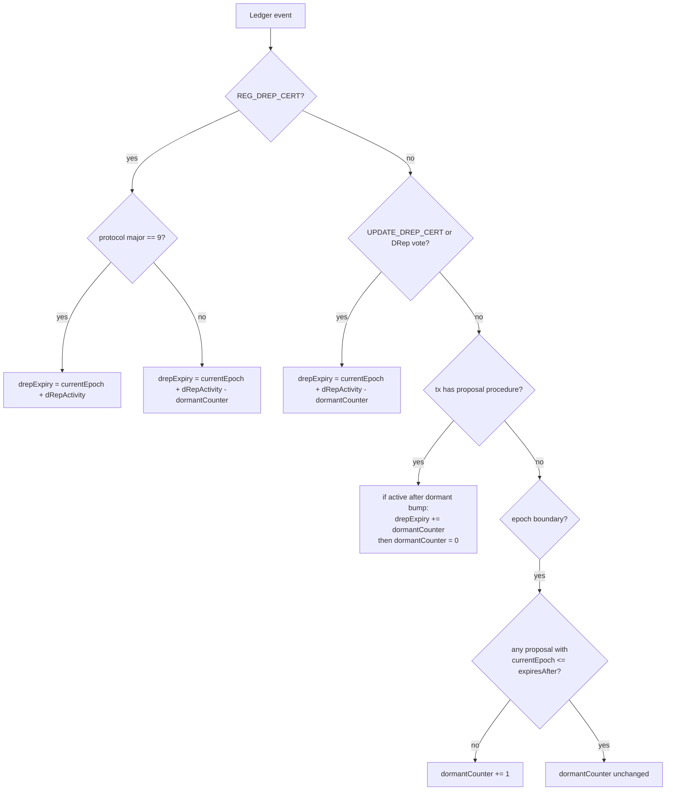
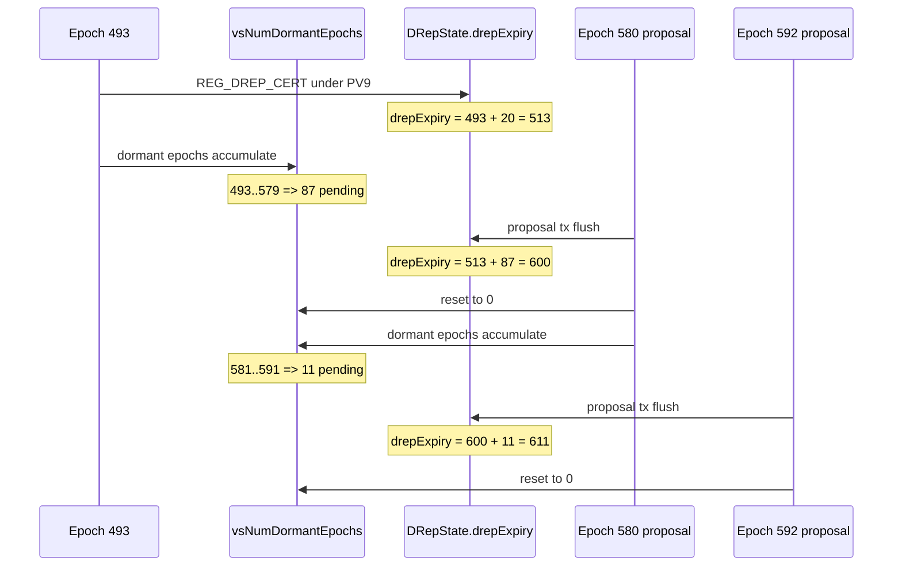

# Cardano Ledger DRep Expiry / `active_until`

Date: 2026-05-27

## Scope

Tài liệu này mô tả cách `cardano-ledger` tính DRep expiry trong Conway era. Trong
ledger, field chuẩn là `DRepState.drepExpiry`. Trong hệ indexer như
`cardano-db-sync`, giá trị này thường được expose dưới tên `active_until`.

Điểm quan trọng: `cardano-ledger` không tính DRep expiry như một phép tính stateless
từ `last_activity_epoch`. Ledger duy trì state gồm:

- `DRepState.drepExpiry`: expiry đã được lưu trong DRep state.
- `VState.vsNumDormantEpochs`: số epoch dormant liên tiếp chưa được flush vào
  `drepExpiry`.

Khi có proposal mới, ledger flush pending dormant epochs vào `drepExpiry` và reset
counter. Khi không có proposal, counter tăng nhưng stored `drepExpiry` không nhất
thiết đổi ngay.

## Reference Files

Các file chính trong `cardano-ledger`:

| File | Vai trò |
| --- | --- |
| `libs/cardano-ledger-core/src/Cardano/Ledger/DRep.hs` | Định nghĩa `DRepState` và lens `drepExpiryL`. |
| `eras/conway/impl/src/Cardano/Ledger/Conway/State/VState.hs` | Lưu map DRep state và dormant counter `vsNumDormantEpochs`. |
| `eras/conway/impl/src/Cardano/Ledger/Conway/Rules/GovCert.hs` | Tính expiry khi register/update DRep certificate. |
| `eras/conway/impl/src/Cardano/Ledger/Conway/Rules/Certs.hs` | Flush dormant epochs khi có proposal, update expiry khi DRep vote. |
| `eras/conway/impl/src/Cardano/Ledger/Conway/Rules/Epoch.hs` | Tăng dormant counter ở epoch boundary. |
| `eras/conway/impl/src/Cardano/Ledger/Conway/Rules/Ledger.hs` | Thứ tự áp dụng proposal/vote expiry update trong transaction. |
| `eras/conway/impl/src/Cardano/Ledger/Conway/Rules/Ratify.hs` | Check DRep expired khi tính ratification. |
| `libs/cardano-ledger-api/src/Cardano/Ledger/Api/State/Query.hs` | Query API trả DRep state sau khi materialize dormant expiry. |
| `/home/sotatek/Projects/cardano-db-sync/cardano-db-sync/src/Cardano/DbSync/Era/Universal/Insert/GovAction.hs` | Mapping từ ledger `drepExpiry` sang DB Sync `drep_distr.active_until`. |

## Mapping To DB Sync `active_until`

`cardano-ledger` không đặt tên field là `active_until`; field ledger là
`DRepState.drepExpiry`. `cardano-db-sync` đặt tên cột là `active_until` khi insert
DRep distribution:

```haskell
-- /home/sotatek/Projects/cardano-db-sync/cardano-db-sync/src/Cardano/DbSync/Era/Universal/Insert/GovAction.hs:393-405
DB.DrepDistr
  { DB.drepDistrHashId = drepId
  , DB.drepDistrAmount = fromIntegral $ Ledger.unCoin $ fromCompact coin
  , DB.drepDistrEpochNo = unEpochNo e
  , DB.drepDistrActiveUntil = unEpochNo <$> isActiveEpochNo drep
  }

isActiveEpochNo :: DRep -> Maybe EpochNo
isActiveEpochNo = \case
  DRepAlwaysAbstain -> Nothing
  DRepAlwaysNoConfidence -> Nothing
  DRepCredential cred -> drepExpiry <$> Map.lookup cred (psDRepState pSnapshot)
```

Vì vậy khi so sánh với `cardano-db-sync.drep_distr.active_until`, baseline là
`drepExpiry` lấy từ `psDRepState` trong ledger snapshot, không phải một cột được
tính lại bằng SQL.

Ledger snapshot chứa DRep state như sau:

```haskell
-- eras/conway/impl/src/Cardano/Ledger/Conway/Governance/DRepPulser.hs:93-102
data PulsingSnapshot era = PulsingSnapshot
  { psProposals :: !(StrictSeq (GovActionState era))
  , psDRepDistr :: !(Map DRep (CompactForm Coin))
  , psDRepState :: !(Map (Credential DRepRole) DRepState)
  , psPoolDistr :: Map (KeyHash StakePool) (CompactForm Coin)
  }
```

`psDRepState` được lấy từ `VState.vsDReps`:

```haskell
-- eras/conway/impl/src/Cardano/Ledger/Conway/Governance.hs:492-505
govState' =
  predictFuturePParams $
    govState
      & cgsDRepPulsingStateL
        .~ DRPulsing
          ( DRepPulser
              { ...
              , dpDRepState = vsDReps vState
              , dpCurrentEpoch = epochNo
              ...
              }
          )
```

## State Model

### `DRepState.drepExpiry`

`DRepState` có field `drepExpiry`:

```haskell
-- libs/cardano-ledger-core/src/Cardano/Ledger/DRep.hs:150-155
data DRepState = DRepState
  { drepExpiry :: !EpochNo
  , drepAnchor :: !(StrictMaybe Anchor)
  , drepDeposit :: !(CompactForm Coin)
  , drepDelegs :: !(Set (Credential Staking))
  }
```

`drepExpiry` là expiry được lưu trong ledger state. Đây là giá trị raw mà indexer
cần hiểu trước khi tự tính `active_until`.

### `VState.vsNumDormantEpochs`

`VState` lưu DRep map và dormant counter:

```haskell
-- eras/conway/impl/src/Cardano/Ledger/Conway/State/VState.hs:56-66
data VState era = VState
  { vsDReps :: !(Map (Credential DRepRole) DRepState)
  , vsCommitteeState :: !(CommitteeState era)
  , vsNumDormantEpochs :: !EpochNo
  -- ^ Number of contiguous epochs in which there are exactly zero
  -- active governance proposals to vote on...
  }
```

Ledger cũng có helper tính actual expiry:

```haskell
-- eras/conway/impl/src/Cardano/Ledger/Conway/State/VState.hs:154-156
vsActualDRepExpiry cred vs =
  binOpEpochNo (+) (vsNumDormantEpochs vs) . drepExpiry <$> Map.lookup cred (vsDReps vs)
```

Ý nghĩa:

- Stored expiry: `drepExpiry`
- Actual expiry trong dormant period: `drepExpiry + vsNumDormantEpochs`
- Khi proposal xuất hiện, ledger materialize actual expiry vào stored expiry rồi
  reset `vsNumDormantEpochs`.

## Core Formula

### Bootstrap phase / PV9

Bootstrap phase được xác định bằng protocol major version 9:

```haskell
-- eras/conway/impl/src/Cardano/Ledger/Conway/Era.hs:169-171
hardforkConwayBootstrapPhase :: ProtVer -> Bool
hardforkConwayBootstrapPhase pv = pvMajor pv == natVersion @9
```

### Registration formula

Khi đăng ký DRep, ledger gọi `computeDRepExpiryVersioned`:

```haskell
-- eras/conway/impl/src/Cardano/Ledger/Conway/Rules/GovCert.hs:220-226
let drepState =
      DRepState
        { drepExpiry =
            computeDRepExpiryVersioned
              cgcePParams
              cgceCurrentEpoch
              (certState ^. certVStateL . vsNumDormantEpochsL)
        ...
        }
```

Versioned formula:

```haskell
-- eras/conway/impl/src/Cardano/Ledger/Conway/Rules/GovCert.hs:286-292
computeDRepExpiryVersioned pp currentEpoch numDormantEpochs
  | hardforkConwayBootstrapPhase (pp ^. ppProtocolVersionL) =
      addEpochInterval currentEpoch (pp ^. ppDRepActivityL)
  | otherwise =
      computeDRepExpiry (pp ^. ppDRepActivityL) currentEpoch numDormantEpochs
```

Tương đương:

```text
if protocol_major == 9:
    drepExpiry = currentEpoch + dRepActivity
else:
    drepExpiry = currentEpoch + dRepActivity - vsNumDormantEpochs
```

PV9 là edge case đặc biệt: registration không subtract dormant epochs.

### General compute formula

```haskell
-- eras/conway/impl/src/Cardano/Ledger/Conway/Rules/GovCert.hs:294-306
computeDRepExpiry ::
  EpochInterval ->
  EpochNo ->
  EpochNo ->
  EpochNo
computeDRepExpiry ppDRepActivity currentEpoch =
  binOpEpochNo
    (-)
    (addEpochInterval currentEpoch ppDRepActivity)
```

Vì function nhận `numDormantEpochs` qua partial application, công thức đầy đủ là:

```text
computeDRepExpiry(dRepActivity, currentEpoch, numDormantEpochs)
  = currentEpoch + dRepActivity - numDormantEpochs
```

## Event Rules

### 1. Register DRep

Source:

- `GovCert.hs:210-233`
- `GovCert.hs:286-292`

Rule:

```text
REG_DREP_CERT:
    if PV9/bootstrap:
        drepExpiry = currentEpoch + dRepActivity
    else:
        drepExpiry = currentEpoch + dRepActivity - vsNumDormantEpochs
```

Registration fails if the DRep is already registered or deposit does not match.

### 2. Update DRep certificate

Update certificate resets expiry using the general formula:

```haskell
-- eras/conway/impl/src/Cardano/Ledger/Conway/Rules/GovCert.hs:255-270
ConwayUpdateDRep cred mAnchor -> do
  Map.member cred (certState ^. certVStateL . vsDRepsL)
    ?! (injectFailure . ConwayDRepNotRegistered) cred
  pure $
    certState
      & certVStateL . vsDRepsL
        %~ Map.adjust
          ( \drepState ->
              drepState
                & drepExpiryL
                  .~ computeDRepExpiry
                    ppDRepActivity
                    cgceCurrentEpoch
                    (certState ^. certVStateL . vsNumDormantEpochsL)
                & drepAnchorL .~ mAnchor
          )
          cred
```

Rule:

```text
UPDATE_DREP_CERT:
    drepExpiry = currentEpoch + dRepActivity - vsNumDormantEpochs
```

Khác với registration, update certificate không dùng `computeDRepExpiryVersioned`.
Vì vậy ngay cả trong PV9, update DRep vẫn đi qua `computeDRepExpiry`.

### 3. DRep vote

Khi DRep vote trong một transaction, ledger update expiry cho DRep voter:

```haskell
-- eras/conway/impl/src/Cardano/Ledger/Conway/Rules/Certs.hs:278-292
updateVotingDRepExpiries tx currentEpoch drepActivity certState =
  let numDormantEpochs = certState ^. certVStateL . vsNumDormantEpochsL
      updateVSDReps vsDReps =
        Map.foldlWithKey'
          ( \dreps voter _ -> case voter of
              DRepVoter cred ->
                Map.adjust
                  (drepExpiryL .~ computeDRepExpiry drepActivity currentEpoch numDormantEpochs)
                  cred
                  dreps
              _ -> dreps
          )
          vsDReps
          (unVotingProcedures $ tx ^. bodyTxL . votingProceduresTxBodyL)
   in certState & certVStateL . vsDRepsL %~ updateVSDReps
```

Rule:

```text
DREP_VOTE:
    drepExpiry = currentEpoch + dRepActivity - vsNumDormantEpochs
```

Only `DRepVoter cred` updates DRep expiry. Committee votes and stake pool votes do
not update `DRepState.drepExpiry`.

### 4. Proposal transaction flushes dormant epochs

Nếu transaction có proposal procedure, ledger bump expiry của active DReps bằng
pending dormant counter rồi reset counter:

```haskell
-- eras/conway/impl/src/Cardano/Ledger/Conway/Rules/Certs.hs:248-267
-- If there is a new governance proposal to vote on in this transaction,
-- AND the number of dormant-epochs recorded is greater than zero, we bump
-- the expiry for all DReps by the number of dormant epochs, and reset the
-- counter to zero.
updateDormantDRepExpiries tx currentEpoch =
  let hasProposals = not . OSet.null $ tx ^. bodyTxL . proposalProceduresTxBodyL
   in if hasProposals
        then certVStateL %~ updateDormantDRepExpiry currentEpoch
        else id
```

Flush implementation:

```haskell
-- eras/conway/impl/src/Cardano/Ledger/Conway/Rules/Certs.hs:313-328
updateDormantDRepExpiry currentEpoch vState =
  if numDormantEpochs == EpochNo 0
    then vState
    else
      vState
        & vsNumDormantEpochsL .~ EpochNo 0
        & vsDRepsL %~ Map.map updateExpiry
  where
    numDormantEpochs = vState ^. vsNumDormantEpochsL
    updateExpiry =
      drepExpiryL
        %~ \currentExpiry ->
          let actualExpiry = binOpEpochNo (+) numDormantEpochs currentExpiry
           in if actualExpiry < currentEpoch
                then currentExpiry
                else actualExpiry
```

Rule:

```text
PROPOSAL_TX:
    if vsNumDormantEpochs == 0:
        no-op
    else:
        for each DRep:
            actualExpiry = drepExpiry + vsNumDormantEpochs
            if actualExpiry < currentEpoch:
                keep drepExpiry unchanged
            else:
                drepExpiry = actualExpiry
        vsNumDormantEpochs = 0
```

Expired DReps are not revived by proposal flush. Equality is important:

```text
actualExpiry < currentEpoch   => expired, do not revive
actualExpiry == currentEpoch  => not less than current epoch, can be materialized
```

### 5. Dormant counter update at epoch boundary

At epoch boundary, ledger increments dormant counter only when there are zero active
governance proposals to vote on:

```haskell
-- eras/conway/impl/src/Cardano/Ledger/Conway/Rules/Epoch.hs:195-201
-- When there have been zero governance proposals to vote on in the previous epoch
-- increase the dormant-epoch counter by one.
updateNumDormantEpochs :: EpochNo -> Proposals era -> VState era -> VState era
updateNumDormantEpochs currentEpoch ps vState =
  if null $ OMap.filter ((currentEpoch <=) . gasExpiresAfter) $ ps ^. pPropsL
    then vState & vsNumDormantEpochsL %~ succ
    else vState
```

This is called during EPOCH transition:

```haskell
-- eras/conway/impl/src/Cardano/Ledger/Conway/Rules/Epoch.hs:337-342
certState2 =
  mkConwayCertState
    -- Increment the dormant epoch counter
    ( updateNumDormantEpochs eNo newProposals vState
        & vsCommitteeStateL %~ updateCommitteeState (govState1 ^. cgsCommitteeL)
    )
```

Active proposal definition:

```text
proposal is active if currentEpoch <= gasExpiresAfter
```

If no such proposal exists, the epoch is dormant and `vsNumDormantEpochs` increases.

## Transaction Ordering

In the LEDGER rule, dormant flush and DRep vote expiry update are applied before
certificate processing for the transaction:

```haskell
-- eras/conway/impl/src/Cardano/Ledger/Conway/Rules/Ledger.hs:382-390
certState' <-
  if hardforkConwayMoveWithdrawalsAndDRepChecksToLedgerRule $ pp ^. ppProtocolVersionL
    then do
      ...
      pure $
        certState
          & updateDormantDRepExpiries tx curEpochNo
          & updateVotingDRepExpiries tx curEpochNo (pp ^. ppDRepActivityL)
          & certDStateL . accountsL %~ drainAccounts withdrawals
```

The order is:

```text
1. If tx has proposal(s), flush dormant epochs and reset vsNumDormantEpochs.
2. If tx has DRep votes, update voting DReps' expiry.
3. Process certificates, including DRep registration/update/unregistration.
```

This ordering matters for same-transaction edge cases:

- Proposal + DRep vote in same transaction:
  - proposal flush runs first,
  - dormant counter becomes zero,
  - DRep vote then sets expiry to `currentEpoch + dRepActivity`.
- Proposal + DRep update certificate in same transaction:
  - proposal flush runs first,
  - certificate update runs after,
  - update uses the reset counter.
- Proposal + DRep registration in same transaction:
  - proposal flush runs first,
  - registration sees the reset counter.

## Query Semantics

Ledger has two useful views:

### Stored state

Stored state is `DRepState.drepExpiry`. This is the raw value in `VState.vsDReps`.
It changes on:

- registration,
- DRep update certificate,
- DRep vote,
- proposal flush.

It does not change just because another dormant epoch passes.

### Actual/materialized query state

The public ledger API query applies `updateDormantDRepExpiry` to a copy of the
current `VState` before returning DRep state:

```haskell
-- libs/cardano-ledger-api/src/Cardano/Ledger/Api/State/Query.hs:180-195
queryDRepState ::
  ConwayEraCertState era =>
  NewEpochState era ->
  Set (Credential DRepRole) ->
  Map (Credential DRepRole) DRepState
queryDRepState nes creds
  | null creds = updateDormantDRepExpiry' vState ^. vsDRepsL
  | otherwise = updateDormantDRepExpiry' vStateFiltered ^. vsDRepsL
  where
    ...
    updateDormantDRepExpiry' = Conway.updateDormantDRepExpiry (nes ^. nesELL)
```

This is why docs and code must distinguish:

```text
stored drepExpiry       = value in VState.vsDReps
actual DRep expiry      = drepExpiry + vsNumDormantEpochs, unless materialized
queryDRepState expiry   = materialized copy after updateDormantDRepExpiry
db-sync active_until    = raw drepExpiry from the ledger snapshot it consumes
```

The ledger test helpers make this distinction explicit:

```haskell
-- eras/conway/impl/testlib/Test/Cardano/Ledger/Conway/ImpTest.hs:1611-1614
binOpEpochNo (+) (vState ^. vsNumDormantEpochsL) (drep' ^. drepExpiryL)
  < currentEpoch

-- eras/conway/impl/testlib/Test/Cardano/Ledger/Conway/ImpTest.hs:1631-1634
let actualDRepExpiry = fromJust $ vsActualDRepExpiry drep vState
actualDRepExpiry `shouldBe` expected
```

## Ratification / Expired Check

When tallying DRep votes, an unregistered or expired DRep is ignored:

```haskell
-- eras/conway/impl/src/Cardano/Ledger/Conway/Rules/Ratify.hs:258-268
dRepAcceptedRatio RatifyEnv {reDRepDistr, reDRepState, reCurrentEpoch} gasDRepVotes govAction =
  ...
  case Map.lookup cred reDRepState of
    Nothing -> (yes, tot) -- drep is not registered, so we don't consider it
    Just drepState
      | reCurrentEpoch > drepExpiry drepState -> (yes, tot) -- drep is expired, so we don't consider it
      | otherwise -> ...
```

Expiry is inclusive:

```text
currentEpoch > drepExpiry   => expired
currentEpoch == drepExpiry  => still not expired by this check
```

## End-To-End State Machine

```mermaid
stateDiagram-v2
    [*] --> NotRegistered

    NotRegistered --> Registered: REG_DREP_CERT
    Registered --> NotRegistered: UNREG_DREP_CERT

    Registered --> Registered: UPDATE_DREP_CERT\nexpiry = epoch + activity - dormantCounter
    Registered --> Registered: DRep vote\nexpiry = epoch + activity - dormantCounter
    Registered --> Registered: epoch with no active proposals\ndormantCounter += 1
    Registered --> Registered: proposal tx\nexpiry += dormantCounter; dormantCounter = 0

    Registered --> Expired: currentEpoch > drepExpiry\nor currentEpoch > drepExpiry + dormantCounter during dormant view
    Expired --> Expired: proposal flush\nif drepExpiry + dormantCounter < currentEpoch, do not revive
    Expired --> Registered: UPDATE_DREP_CERT or DRep vote\nif cert/vote is accepted for registered DRep
```



## Formula Decision Tree



## Timeline Example

Example with PV9 registration and two dormant flushes:



## Edge Cases

### PV9 registration ignores dormant epochs

In bootstrap phase, DRep registration uses:

```text
drepExpiry = currentEpoch + dRepActivity
```

It does not subtract `vsNumDormantEpochs`. This is explicit in
`computeDRepExpiryVersioned`.

### PV9 update/vote does not use the registration exception

`ConwayUpdateDRep` and `updateVotingDRepExpiries` call `computeDRepExpiry`
directly. Therefore update/vote use:

```text
drepExpiry = currentEpoch + dRepActivity - vsNumDormantEpochs
```

even if protocol major is 9.

### Dormant epochs do not continuously mutate stored `drepExpiry`

When epochs are dormant, ledger increments `vsNumDormantEpochs`. Stored
`drepExpiry` stays unchanged until one of these events occurs:

- proposal transaction,
- DRep vote,
- DRep update certificate,
- DRep registration.

### Proposal epoch ordering can create off-by-one mistakes

If an epoch is considered dormant by an epoch-level summary, but a proposal
transaction exists in that epoch, the proposal transaction flushes the pending
counter and resets it. Indexers must not simply subtract or add the epoch-level
`dormant_epoch_count` without replaying proposal event ordering.

### Same transaction proposal + DRep vote

Proposal flush runs before vote expiry update. The voting DRep's final expiry in
that transaction is the vote formula after the counter reset:

```text
drepExpiry = currentEpoch + dRepActivity
```

assuming the proposal flush reset `vsNumDormantEpochs` to zero.

### Same transaction proposal + DRep update cert

Proposal flush runs before certificate processing. The update certificate then
sets expiry with the reset counter.

### Expired DRep is not revived by proposal flush

In `updateDormantDRepExpiry`, if:

```text
drepExpiry + vsNumDormantEpochs < currentEpoch
```

ledger keeps the old `drepExpiry`. The proposal flush does not revive the DRep.

### Expiry is inclusive

Ratification treats a DRep as expired only when:

```text
currentEpoch > drepExpiry
```

So `currentEpoch == drepExpiry` is still not expired by that check.

### `AlwaysAbstain` and `AlwaysNoConfidence` do not have DRep expiry

`DRepState` is keyed by credential DReps. Predefined DReps such as
`AlwaysAbstain` and `AlwaysNoConfidence` do not have a `DRepState.drepExpiry`
entry, so `active_until` is not applicable to them.

### Query result may differ from raw stored state

`queryDRepState` returns a materialized view where pending dormant epochs have
been applied to a copy of the state. If an indexer compares against a table that
stores raw snapshot `drepExpiry`, it must not substitute `queryDRepState`
semantics unless the baseline uses the same materialized view.

## Implementation Checklist For Indexers

To reproduce ledger-compatible `active_until`:

1. Track raw `drepExpiry` and `vsNumDormantEpochs` as state, not only the latest
   DRep activity epoch.
2. On DRep registration:
   - PV9: `epoch + dRepActivity`
   - PV10+: `epoch + dRepActivity - dormantCounter`
3. On DRep update certificate: `epoch + dRepActivity - dormantCounter`.
4. On DRep vote: `epoch + dRepActivity - dormantCounter`.
5. On transaction with proposals:
   - flush `dormantCounter` into active DReps,
   - do not revive expired DReps,
   - reset `dormantCounter`.
6. Process same-transaction ordering as ledger:
   - proposal flush,
   - DRep vote expiry update,
   - certificates.
7. At epoch boundary, increment dormant counter only when no active proposal
   remains with `currentEpoch <= gasExpiresAfter`.
8. Distinguish raw stored `drepExpiry` from materialized actual expiry
   `drepExpiry + dormantCounter`.

## Pseudocode

```text
state:
    drepExpiryByCred: Map<Cred, EpochNo>
    dormantCounter: EpochNo

onTransaction(tx, currentEpoch, dRepActivity, protocolMajor):
    if tx.hasProposalProcedures:
        if dormantCounter > 0:
            for each cred, expiry in drepExpiryByCred:
                actual = expiry + dormantCounter
                if actual >= currentEpoch:
                    drepExpiryByCred[cred] = actual
            dormantCounter = 0

    for each DRep vote in tx:
        if voter cred is registered:
            drepExpiryByCred[cred] = currentEpoch + dRepActivity - dormantCounter

    for each certificate in tx:
        if cert is REG_DREP_CERT:
            if protocolMajor == 9:
                drepExpiryByCred[cred] = currentEpoch + dRepActivity
            else:
                drepExpiryByCred[cred] = currentEpoch + dRepActivity - dormantCounter

        if cert is UPDATE_DREP_CERT:
            drepExpiryByCred[cred] = currentEpoch + dRepActivity - dormantCounter

        if cert is UNREG_DREP_CERT:
            remove cred from drepExpiryByCred

onEpochBoundary(currentEpoch, proposalsAfterEpochTransition):
    if no proposal where currentEpoch <= proposal.expiresAfter:
        dormantCounter += 1

actualExpiry(cred):
    return drepExpiryByCred[cred] + dormantCounter
```
