&nbsp;

# 🧠 Yaci Store - Design

## 🏗️ High Level Design

Yaci Store is designed as a modular, event-driven blockchain indexing system for Cardano. It provides a pluggable architecture that allows developers to create scoped indexers with selective data processing capabilities.

### 🎯 Design Goals

- **Modularity**: Provide a Java library for creating scoped indexers
- **Selectivity**: Handle selective data indexing with filtering capabilities
- **Flexibility**: Allow behavior overrides and custom implementations
- **Reliability**: Manage rollbacks and ensure data consistency
- **Extensibility**: Support out-of-the-box applications and custom extensions

---

## 🏛️ Architecture Overview

import ZoomableDiagram from './ZoomableDiagram'

```mermaid
%%{init: {'theme':'base', 'themeVariables': {'primaryColor': '#ffffff', 'primaryTextColor': '#000000', 'primaryBorderColor': '#cccccc', 'lineColor': '#666666', 'secondaryColor': '#f9f9f9', 'tertiaryColor': '#ffffff', 'background': '#ffffff', 'mainBkg': '#ffffff', 'secondBkg': '#f9f9f9', 'tertiaryBkg': '#ffffff'}, 'flowchart': {'htmlLabels': true}, 'fontFamily': 'arial', 'fontSize': '18px'}}%%
flowchart TD
    %% Simple top-down flow
    CardanoNode["🌐 Cardano Node"]
    
    Core["⚙️ Core Module<br/>Data Processing & Events"]
    
    Stores["🏪 Stores Layer<br/>Block | UTxO | TX | Stake | Assets<br/>Epoch | Scripts | Ledger | Gov"]
    
    EventBus["📡 Event Bus<br/>Inter-Component Communication"]
    
    subgraph Output["🔄 OUTPUT LAYER"]
        RestAPI["🌐 REST APIs"]
        Aggregates["📊 Aggregates"] 
        TxSubmit["📤 TX Submit"]
    end
    
    Database["💾 Database<br/>PostgreSQL | MySQL | H2"]
    
    %% Clean linear flow
    CardanoNode --> Core
    Core --> Stores
    Stores --> EventBus
    EventBus --> RestAPI
    EventBus --> Aggregates
    EventBus --> TxSubmit
    Core --> Database
    Stores --> Database
    
    %% Clean, simple styling
    style CardanoNode fill:#f8f9fa,stroke:#495057,stroke-width:3px,color:#000000,font-size:20px
    style Core fill:#e3f2fd,stroke:#1976d2,stroke-width:3px,color:#000000,font-size:20px
    style Stores fill:#e8f5e8,stroke:#2e7d32,stroke-width:3px,color:#000000,font-size:20px
    style EventBus fill:#eceff1,stroke:#546e7a,stroke-width:3px,color:#000000,font-size:20px
    style Output fill:#fff3e0,stroke:#f57c00,stroke-width:2px,color:#000000
    style Database fill:#f3e5f5,stroke:#7b1fa2,stroke-width:3px,color:#000000,font-size:20px
    
    style RestAPI fill:#e8f5e8,stroke:#2e7d32,stroke-width:2px,color:#000000,font-size:18px
    style Aggregates fill:#fff3e0,stroke:#f57c00,stroke-width:2px,color:#000000,font-size:18px
    style TxSubmit fill:#fce4ec,stroke:#c2185b,stroke-width:2px,color:#000000,font-size:18px
```

<ZoomableDiagram>

</ZoomableDiagram>

---

### 🧱 Core Module

The core module is the backbone of Yaci Store. It serves as the primary interface between the Cardano blockchain and the indexing system.

**Key Responsibilities:**
- **Data Reading**: Connects to Cardano nodes and reads blockchain data
- **Event Broadcasting**: Publishes Spring events for processed blocks and transactions
- **State Management**: Tracks current processing point in the database
- **Rollback Handling**: Manages blockchain reorganizations and rollbacks

**Event Types:**
- `BlockEvent`: Published when a new block is processed
- `TransactionEvent`: Published for each transaction in a block
- `RollbackEvent`: Published when a rollback occurs

---

### 🏬 Stores

Each store is a specialized module designed for a specific data type or use case. Stores operate independently but can communicate through events.

**Store Capabilities:**
- **Event Listening**: Subscribe to events from the core module
- **Data Processing**: Transform raw blockchain data into structured formats
- **Persistence**: Store processed data in the database
- **Event Publishing**: Publish derived events for other components (optional)
- **REST Endpoints**: Provide API access to stored data (optional)

**Available Stores in v0.1.x:**

| Store Name | Description | Spring Boot Starter | Status |
|------------|-------------|---------------------|--------|
| **Block Store** | Processes block headers and metadata | `yaci-store-block-spring-boot-starter` | ✅ Available |
| **Transaction Store** | Handles transaction data and metadata | `yaci-store-transaction-spring-boot-starter` | ✅ Available |
| **UTxO Store** | Manages unspent transaction outputs | `yaci-store-utxo-spring-boot-starter` | ✅ Available |
| **Staking Store** | Processes staking-related data | `yaci-store-staking-spring-boot-starter` | ✅ Available |
| **Script Store** | Manages smart contract scripts | `yaci-store-script-spring-boot-starter` | ✅ Available |
| **Epoch Store** | Handles epoch-related data | `yaci-store-epoch-spring-boot-starter` | ✅ Available |
| **Assets Store** | Manages native tokens and NFTs | `yaci-store-assets-spring-boot-starter` | ✅ Available |
| **Governance Store** | Processes governance-related data (voting, proposals) | `yaci-store-governance-spring-boot-starter` | ✅ Available |
| **Metadata Store** | Stores transaction metadata | `yaci-store-metadata-spring-boot-starter` | ✅ Available |
| **MIR Store** | Processes Move Instantaneous Rewards certificates | `yaci-store-mir-spring-boot-starter` | ✅ Available |

> ⚠️ **Note**: The Governance Store functionality might not be complete in v0.1.x and may have limited features compared to the full v2.0.0 implementation.

> 💡 **Note**: To simplify rollback handling, stores do not perform data aggregation directly.

---

### 📊 Aggregates

Aggregates handle complex data aggregation across multiple stores. They are responsible for creating derived data that requires information from multiple sources.

**Features:**
- **Cross-Store Data**: Aggregate data from multiple stores
- **Snapshot-Based**: Store data snapshots for efficient rollback handling
- **Event-Driven**: React to events from multiple stores
- **Experimental Status**: Currently in experimental phase

**Available Aggregates:**
- **Account Aggregate**: Provides account balance and transaction history
  - Depends on UTxO Store events
  - Maintains balance snapshots per slot
  - Supports efficient balance queries

---

### 💾 Persistence Layer

The persistence layer provides flexible data storage options with automatic schema management.

**Database Support:**
- **PostgreSQL**: Recommended for production use
- **MySQL**: Alternative production database
- **H2**: Lightweight option for development and testing

**Features:**
- **Auto-Schema Generation**: Flyway manages database schema evolution
- **Custom Storage**: Implement custom storage backends via Storage API
- **Rollback Support**: Slot-based rollback mechanism
- **Migration Support**: Automatic schema migrations

---

### 📤 Transaction Submission

The submit module enables transaction submission directly to Cardano nodes.

**Submission Methods:**
- **N2C Protocol**: Direct node-to-client communication
- **Submit API**: HTTP-based transaction submission
- **Local Node**: Submit to local Cardano node
- **Remote Node**: Submit to remote Cardano node

---

## 🧩 Stores - Components

### 🧬 Store Design

<ZoomableDiagram>

</ZoomableDiagram>

A store is composed of the following components:

#### ⚙️ 1. Processor

A processor is responsible for processing data. It listens to events published by the core module and processes the data contained in the event. A processor can also publish derived events. For example: UtxoProcessor in the utxo store listens to TransactionEvent and processes the UTxOs contained in the transaction. It also publishes AddressUtxo derived event for each UTxO.

Developer can write their own processor by listening to events published by the core module.

#### 💽 2. Storage

A storage defines the interface for storing data. The implementation of a storage api is responsible for storing data in a persistent store. By default, Yaci Store uses a relational database to store data and each store provides a default implementation of corresponding storage api using JPA.

This can be overridden by developers by implementing the storage api in consuming applications.

#### 🌐 3. Controller

A controller provides REST endpoints to retrieve store's data. It uses the storage api to retrieve data from the persistent store. Out of the box, Yaci Store provides some common REST endpoints for all stores. But, developers can implement their own REST endpoints.

---

## 🪃 Handling Rollbacks

Yaci Store follows a simply strategy to handle rollbacks. As store modules don't handle any data aggregation, the rollback handling becomes simple. Each table in a store maintains a slot column. When a processor received a RollbackEvent event, it deletes all the records with a slot greater than the rollback slot mentioned in the event.

But as aggregates handle data aggregation, the rollback handling becomes a bit complex. But with a simple strategy, we can handle rollbacks in aggregates as well. For example, the Account module aggregates account balance. But instead of storing the account balance for an address in one record, balance snapshot is stored for a slot. As we don't update existing records during aggregation, rollback can be handled by simply deleting all the records with a slot greater than the rollback slot mentioned in the event.

If you are using Yaci Store as a library in your application with your own domain model and tables, you can follow the similar strategy to handle rollbacks.

---

## 🔁 Idempotency

Though Yaci Store ensures that the same event is not published more than once, it is possible that the same event is published more than once in some scenarios. All out-of-box modules are idepotent. But if you are writing your own stores, you should make sure that your modules are idempotent.

---

## 🧵 Sequential Block Processing

```mermaid
%%{init: {'theme':'base', 'themeVariables': {'primaryColor': '#ffffff', 'primaryTextColor': '#000000', 'primaryBorderColor': '#cccccc', 'lineColor': '#666666', 'secondaryColor': '#f9f9f9', 'tertiaryColor': '#ffffff', 'background': '#ffffff', 'mainBkg': '#ffffff', 'secondBkg': '#f9f9f9', 'tertiaryBkg': '#ffffff'}, 'flowchart': {'htmlLabels': true}, 'fontFamily': 'arial', 'fontSize': '28px'}}%%
flowchart TD
    subgraph CardanoChain["🔗 Cardano Chain"]
        BN["Block N<br/>Tx: 50<br/>Slot: 1000000"]
        BN1["Block N+1<br/>Tx: 75<br/>Slot: 1000001"]
        BN2["Block N+2<br/>Tx: 120<br/>Slot: 1000002"]
        BN3["Block N+3<br/>Tx: 95<br/>Slot: 1000003"]
        
        BN --> BN1 --> BN2 --> BN3
    end
    
    subgraph CoreModule["⚙️ Core Module"]
        RBN["📖 Read Block N"]
        RBN1["📖 Read Block N+1"]
        RBN2["📖 Read Block N+2"]
        
        PEN["📡 Publish Event N"]
        PEN1["📡 Publish Event N+1"]
        PEN2["📡 Publish Event N+2"]
        
        WN["⏳ Wait for All Stores N"]
        WN1["⏳ Wait for All Stores N+1"]
        WN2["⏳ Wait for All Stores N+2"]
        
        RBN --> PEN --> WN
        RBN1 --> PEN1 --> WN1
        RBN2 --> PEN2 --> WN2
        
        WN --> RBN1
        WN1 --> RBN2
    end
    
    subgraph StoresLayer["🏪 Stores Layer"]
        subgraph SequentialProcessing["Sequential Processing"]
            PN["⚙️ Process Block N"]
            PN1["⚙️ Process Block N+1"]
            PN2["⚙️ Process Block N+2"]
            
            PN --> PN1 --> PN2
        end
        
        subgraph StoreTypes["Store Types"]
            BS["🏬 Block Store"]
            US["🏬 UTxO Store"]
            TS["🏬 Transaction Store"]
            AS["🏬 Assets Store"]
            SS["🏬 Staking Store"]
            ScS["🏬 Scripts Store"]
        end
        
        subgraph DataStorage["Data Storage"]
            SDN["💾 Store Data N"]
            SDN1["💾 Store Data N+1"]
            SDN2["💾 Store Data N+2"]
            
            SDN --> SDN1 --> SDN2
        end
    end
    
    BN --> RBN
    BN1 --> RBN1
    BN2 --> RBN2
    
    PEN --> PN
    PEN1 --> PN1
    PEN2 --> PN2
    
    PN --> SDN
    PN1 --> SDN1
    PN2 --> SDN2
    
    SDN --> WN
    SDN1 --> WN1
    SDN2 --> WN2
    
    style BN fill:#e3f2fd,stroke:#1976d2,stroke-width:5px,color:#000000
    style BN1 fill:#e3f2fd,stroke:#1976d2,stroke-width:5px,color:#000000
    style BN2 fill:#e3f2fd,stroke:#1976d2,stroke-width:5px,color:#000000
    style BN3 fill:#e3f2fd,stroke:#1976d2,stroke-width:5px,color:#000000
    style RBN fill:#e8f5e8,stroke:#2e7d32,stroke-width:5px,color:#000000
    style RBN1 fill:#e8f5e8,stroke:#2e7d32,stroke-width:5px,color:#000000
    style RBN2 fill:#e8f5e8,stroke:#2e7d32,stroke-width:5px,color:#000000
    style PEN fill:#e0f7fa,stroke:#00695c,stroke-width:5px,color:#000000
    style PEN1 fill:#e0f7fa,stroke:#00695c,stroke-width:5px,color:#000000
    style PEN2 fill:#e0f7fa,stroke:#00695c,stroke-width:5px,color:#000000
    style WN fill:#f3e5f5,stroke:#7b1fa2,stroke-width:5px,color:#000000
    style WN1 fill:#f3e5f5,stroke:#7b1fa2,stroke-width:5px,color:#000000
    style WN2 fill:#f3e5f5,stroke:#7b1fa2,stroke-width:5px,color:#000000
    style PN fill:#fce4ec,stroke:#c2185b,stroke-width:5px,color:#000000
    style PN1 fill:#fce4ec,stroke:#c2185b,stroke-width:5px,color:#000000
    style PN2 fill:#fce4ec,stroke:#c2185b,stroke-width:5px,color:#000000
    style BS fill:#e8eaf6,stroke:#3f51b5,stroke-width:5px,color:#000000
    style US fill:#e1f5fe,stroke:#0277bd,stroke-width:5px,color:#000000
    style TS fill:#e0f2f1,stroke:#00695c,stroke-width:5px,color:#000000
    style AS fill:#eceff1,stroke:#546e7a,stroke-width:5px,color:#000000
    style SS fill:#ffebee,stroke:#d32f2f,stroke-width:5px,color:#000000
    style ScS fill:#f5f5f5,stroke:#616161,stroke-width:5px,color:#000000
    style SDN fill:#eceff1,stroke:#455a64,stroke-width:5px,color:#000000
    style SDN1 fill:#eceff1,stroke:#455a64,stroke-width:5px,color:#000000
    style SDN2 fill:#eceff1,stroke:#455a64,stroke-width:5px,color:#000000
```

<ZoomableDiagram>

</ZoomableDiagram>

**✅ Advantages:**
- Simple and predictable processing order
- Easy rollback handling
- Guaranteed data consistency
- Lower memory usage

**⚠️ Limitations:**
- Slower overall throughput
- Underutilizes system resources
- Processing bottlenecks affect entire chain

---

## 🧶 Parallel Block Processing

```mermaid
%%{init: {'theme':'base', 'themeVariables': {'primaryColor': '#ffffff', 'primaryTextColor': '#000000', 'primaryBorderColor': '#cccccc', 'lineColor': '#666666', 'secondaryColor': '#f9f9f9', 'tertiaryColor': '#ffffff', 'background': '#ffffff', 'mainBkg': '#ffffff', 'secondBkg': '#f9f9f9', 'tertiaryBkg': '#ffffff'}, 'flowchart': {'htmlLabels': true}, 'fontFamily': 'arial', 'fontSize': '28px'}}%%
flowchart TD
    subgraph CardanoChain["🔗 Cardano Chain"]
        BN["Block N<br/>Tx: 50<br/>Slot: 1000000"]
        BN1["Block N+1<br/>Tx: 75<br/>Slot: 1000001"]
        BN2["Block N+2<br/>Tx: 120<br/>Slot: 1000002"]
        BN3["Block N+3<br/>Tx: 95<br/>Slot: 1000003"]
        
        BN --> BN1 --> BN2 --> BN3
    end
    
    subgraph CoreModule["⚙️ Core Module"]
        RBN["📖 Block N"]
        RBN1["📖 Block N+1"]
        RBN2["📖 Block N+2"]
        RBN3["📖 Block N+3"]
        
        EN["📡 Event N"]
        EN1["📡 Event N+1"]
        EN2["📡 Event N+2"]
        EN3["📡 Event N+3"]
        
        PD["🚀 Parallel Dispatch"]
        
        RBN --> EN
        RBN1 --> EN1
        RBN2 --> EN2
        RBN3 --> EN3
        
        EN --> PD
        EN1 --> PD
        EN2 --> PD
        EN3 --> PD
    end
    
    subgraph StoresLayer["🏪 Stores Layer - Parallel Processing"]
        subgraph ThreadPool1["Thread Pool 1"]
            BS["🏬 Block Store"]
            BSN["🔄 Process N"]
            BSN1["🔄 Process N+1"]
            BSN2["🔄 Process N+2"]
        end
        
        subgraph ThreadPool2["Thread Pool 2"]
            US["🏬 UTxO Store"]
            USN["🔄 Process N"]
            USN1["🔄 Process N+1"]
            USN2["🔄 Process N+2"]
        end
        
        subgraph ThreadPool3["Thread Pool 3"]
            AS["🏬 Assets Store"]
            ASN["🔄 Process N"]
            ASN1["🔄 Process N+1"]
            ASN2["🔄 Process N+2"]
        end
        
        subgraph ThreadPool4["Thread Pool 4"]
            TS["🏬 Tx Store"]
            TSN["🔄 Process N"]
            TSN1["🔄 Process N+1"]
            TSN2["🔄 Process N+2"]
        end
        
        subgraph ThreadPool5["Thread Pool 5"]
            SS["🏬 Stake Store"]
            SSN["🔄 Process N"]
            SSN1["🔄 Process N+1"]
            SSN2["🔄 Process N+2"]
        end
        
        subgraph ThreadPool6["Thread Pool 6"]
            ScS["🏬 Script Store"]
            ScSN["🔄 Process N"]
            ScSN1["🔄 Process N+1"]
            ScSN2["🔄 Process N+2"]
        end
        
        CDS["💾 Concurrent Data Storage<br/>with Slot-based Ordering"]
    end
    
    BN --> RBN
    BN1 --> RBN1
    BN2 --> RBN2
    BN3 --> RBN3
    
    PD --> BSN
    PD --> USN
    PD --> ASN
    PD --> TSN
    PD --> SSN
    PD --> ScSN
    
    BSN --> CDS
    USN --> CDS
    ASN --> CDS
    TSN --> CDS
    SSN --> CDS
    ScSN --> CDS
    
    style BN fill:#e3f2fd,stroke:#1976d2,stroke-width:5px,color:#000000
    style BN1 fill:#e3f2fd,stroke:#1976d2,stroke-width:5px,color:#000000
    style BN2 fill:#e3f2fd,stroke:#1976d2,stroke-width:5px,color:#000000
    style BN3 fill:#e3f2fd,stroke:#1976d2,stroke-width:5px,color:#000000
    style RBN fill:#e8f5e8,stroke:#2e7d32,stroke-width:5px,color:#000000
    style RBN1 fill:#e8f5e8,stroke:#2e7d32,stroke-width:5px,color:#000000
    style RBN2 fill:#e8f5e8,stroke:#2e7d32,stroke-width:5px,color:#000000
    style RBN3 fill:#e8f5e8,stroke:#2e7d32,stroke-width:5px,color:#000000
    style EN fill:#e0f7fa,stroke:#00695c,stroke-width:5px,color:#000000
    style EN1 fill:#e0f7fa,stroke:#00695c,stroke-width:5px,color:#000000
    style EN2 fill:#e0f7fa,stroke:#00695c,stroke-width:5px,color:#000000
    style EN3 fill:#e0f7fa,stroke:#00695c,stroke-width:5px,color:#000000
    style PD fill:#f3e5f5,stroke:#7b1fa2,stroke-width:5px,color:#000000
    style BS fill:#e8eaf6,stroke:#3f51b5,stroke-width:5px,color:#000000
    style US fill:#e1f5fe,stroke:#0277bd,stroke-width:5px,color:#000000
    style AS fill:#eceff1,stroke:#546e7a,stroke-width:5px,color:#000000
    style TS fill:#fce4ec,stroke:#c2185b,stroke-width:5px,color:#000000
    style SS fill:#ffebee,stroke:#d32f2f,stroke-width:5px,color:#000000
    style ScS fill:#f5f5f5,stroke:#616161,stroke-width:5px,color:#000000
    style BSN fill:#e8eaf6,stroke:#3f51b5,stroke-width:5px,color:#000000
    style BSN1 fill:#e8eaf6,stroke:#3f51b5,stroke-width:5px,color:#000000
    style BSN2 fill:#e8eaf6,stroke:#3f51b5,stroke-width:5px,color:#000000
    style USN fill:#e1f5fe,stroke:#0277bd,stroke-width:5px,color:#000000
    style USN1 fill:#e1f5fe,stroke:#0277bd,stroke-width:5px,color:#000000
    style USN2 fill:#e1f5fe,stroke:#0277bd,stroke-width:5px,color:#000000
    style ASN fill:#eceff1,stroke:#546e7a,stroke-width:5px,color:#000000
    style ASN1 fill:#eceff1,stroke:#546e7a,stroke-width:5px,color:#000000
    style ASN2 fill:#eceff1,stroke:#546e7a,stroke-width:5px,color:#000000
    style TSN fill:#fce4ec,stroke:#c2185b,stroke-width:5px,color:#000000
    style TSN1 fill:#fce4ec,stroke:#c2185b,stroke-width:5px,color:#000000
    style TSN2 fill:#fce4ec,stroke:#c2185b,stroke-width:5px,color:#000000
    style SSN fill:#ffebee,stroke:#d32f2f,stroke-width:5px,color:#000000
    style SSN1 fill:#ffebee,stroke:#d32f2f,stroke-width:5px,color:#000000
    style SSN2 fill:#ffebee,stroke:#d32f2f,stroke-width:5px,color:#000000
    style ScSN fill:#f5f5f5,stroke:#616161,stroke-width:5px,color:#000000
    style ScSN1 fill:#f5f5f5,stroke:#616161,stroke-width:5px,color:#000000
    style ScSN2 fill:#f5f5f5,stroke:#616161,stroke-width:5px,color:#000000
    style CDS fill:#eceff1,stroke:#455a64,stroke-width:5px,color:#000000
```

<ZoomableDiagram>

</ZoomableDiagram>

**✅ Advantages:**
- Higher throughput and performance
- Better resource utilization
- Independent store processing
- Scalable with available CPU cores

**⚠️ Considerations:**
- More complex rollback coordination
- Increased memory usage
- Requires careful synchronization
- Store interdependencies need management

