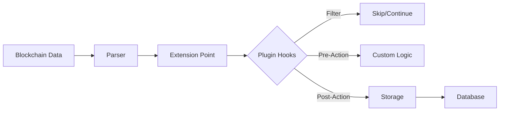

&nbsp;

# 📚 Plugin API Guide

Comprehensive reference for the Yaci Store Plugin API, covering all extension points, domain objects, and advanced patterns.

---

## 🏗️ Architecture Overview

The Plugin Framework operates on a **hook-based architecture** where plugins register callbacks at specific **extension points** in the indexing pipeline.



---

## 🔌 Extension Points Reference

### 📊 Transaction Extension Points

| Extension Point | Trigger | Available Data |
|-----------------|---------|----------------|
| `transaction.save` | Before transaction storage | `Transaction` object |
| `transaction.saved` | After transaction storage | `Transaction` + `txId` |
| `utxo.unspent.save` | Before UTXO storage | `UnspentTxOutput` |
| `utxo.spent.save` | Before spent UTXO storage | `SpentTxOutput` |

### 🏷️ Metadata Extension Points

| Extension Point | Trigger | Available Data |
|-----------------|---------|----------------|
| `metadata.save` | Before metadata storage | `TxMetadata` object |
| `metadata.saved` | After metadata storage | `TxMetadata` + storage result |

### 🏛️ Governance Extension Points  

| Extension Point | Trigger | Available Data |
|-----------------|---------|----------------|
| `governance.drep.save` | Before DRep storage | `DRep` object |
| `governance.proposal.save` | Before proposal storage | `GovernanceProposal` |
| `governance.vote.save` | Before vote storage | `Vote` object |

### 💰 Stake & Rewards Extension Points

| Extension Point | Trigger | Available Data |
|-----------------|---------|----------------|
| `stake.registration.save` | Before stake registration | `StakeRegistration` |
| `stake.delegation.save` | Before delegation storage | `StakeDelegation` |
| `rewards.save` | Before rewards storage | `Reward` object |

### 🏊 Pool Extension Points

| Extension Point | Trigger | Available Data |
|-----------------|---------|----------------|
| `pool.registration.save` | Before pool registration | `PoolRegistration` |
| `pool.retirement.save` | Before pool retirement | `PoolRetirement` |

---

## 🔧 Plugin Hook Types

### 1. 🔍 Filter Hooks

Control what data gets stored:

```javascript
function filterMetadata(metadata, context) {
    // Return true to store, false to skip
    return metadata.label === '721' || metadata.label === '20';
}
```

**Use Cases:**
- Skip unnecessary data
- Implement custom business logic
- Reduce storage requirements

### 2. ⚡ Pre-Action Hooks  

Execute logic before storage:

```javascript
function preProcessTransaction(transaction, context) {
    // Enrich transaction data
    transaction.customField = analyzeTransaction(transaction);
    
    // Log processing
    console.log(`Processing tx: ${transaction.hash}`);
    
    // Store in custom table
    jdbc.update(
        "INSERT INTO custom_tx_log (tx_hash, processed_at) VALUES (?, ?)",
        [transaction.hash, new Date()]
    );
}
```

**Use Cases:**
- Data enrichment
- Custom logging
- Trigger external systems
- Validation

### 3. 🎯 Post-Action Hooks

Execute logic after successful storage:

```javascript
function postProcessMetadata(metadata, context) {
    // Send notification
    http.post('https://webhook.example.com/metadata', {
        txHash: metadata.txHash,
        label: metadata.label,
        storedAt: new Date().toISOString()
    });
    
    // Update statistics
    global_state.metadataCount = (global_state.metadataCount || 0) + 1;
}
```

**Use Cases:**
- Notifications
- Statistics tracking
- Cache updates
- External integrations

---

## 📋 Domain Objects Reference

### 🧾 Transaction Object

```javascript
{
    hash: "abc123...",           // Transaction hash
    blockHash: "def456...",      // Block hash
    blockNumber: 8234567,        // Block number
    slot: 87654321,              // Slot number
    index: 0,                    // Transaction index in block
    inputs: [...],               // Array of TxInput objects
    outputs: [...],              // Array of TxOutput objects  
    fee: 170000,                 // Transaction fee in lovelace
    ttl: 87660000,               // Time to live
    validContract: true,         // Contract validation status
    scriptDataHash: "...",       // Script data hash
    withdrawals: [...],          // Array of withdrawals
    certificates: [...],         // Array of certificates
    auxiliaryData: {...},        // Auxiliary data
    scriptRef: {...},            // Script reference
    totalOutput: 1500000,        // Total output amount
    mint: [...],                 // Minted assets
    collateralInputs: [...],     // Collateral inputs
    requiredSigners: [...]       // Required signers
}
```

### 🏷️ Metadata Object

```javascript
{
    txHash: "abc123...",         // Transaction hash
    label: "721",                // Metadata label
    cbor: "a1190721a1...",       // CBOR representation
    json: {...},                 // JSON representation
    slot: 87654321,              // Slot number
    blockNumber: 8234567,        // Block number
    blockTime: 1640995200        // Block timestamp
}
```

### 💰 UTXO Objects

#### UnspentTxOutput
```javascript
{
    txHash: "abc123...",         // Transaction hash
    outputIndex: 0,              // Output index
    address: "addr1...",         // Bech32 address
    amount: [...],               // Array of amounts
    dataHash: "...",             // Data hash
    inlineDatum: "...",          // Inline datum
    scriptRef: {...},            // Script reference
    blockNumber: 8234567,        // Block number
    blockTime: 1640995200        // Block timestamp
}
```

#### SpentTxOutput
```javascript
{
    txHash: "def456...",         // Spending transaction hash
    spentTxHash: "abc123...",    // Original transaction hash
    spentOutputIndex: 0,         // Original output index
    blockNumber: 8234568,        // Spending block number
    blockTime: 1640995260        // Spending timestamp
}
```

### 🏛️ Governance Objects

#### GovernanceProposal
```javascript
{
    txHash: "abc123...",         // Transaction hash
    certIndex: 0,                // Certificate index
    type: "TREASURY_WITHDRAWALS", // Proposal type
    description: "...",          // Description
    deposit: 50000000000,        // Deposit amount
    returnAddress: "stake1...",  // Return address
    governanceActionId: "...",   // Action ID
    votingProcedures: [...],     // Voting procedures
    proposalProcedures: [...]    // Proposal procedures
}
```

---

## 🔄 Event System

### 📡 Available Events

| Event Type | Trigger | Event Data |
|------------|---------|------------|
| `BlockEvent` | New block processed | `{ block, transactions }` |
| `TransactionEvent` | New transaction processed | `{ transaction, utxos }` |
| `MetadataEvent` | Metadata processed | `{ metadata }` |
| `UtxoEvent` | UTXO created/spent | `{ utxo, type }` |
| `GovernanceEvent` | Governance action | `{ proposal, votes }` |
| `EpochEvent` | Epoch boundary | `{ epoch, summary }` |

### 🎧 Event Handler Example

```javascript
function handleBlockEvent(blockEvent, context) {
    const { block, transactions } = blockEvent;
    
    // Process block data
    console.log(`Processing block ${block.number} with ${transactions.length} transactions`);
    
    // Custom analytics
    const totalFees = transactions.reduce((sum, tx) => sum + tx.fee, 0);
    
    // Store custom metrics
    jdbc.update(`
        INSERT INTO block_metrics (block_number, tx_count, total_fees, processed_at) 
        VALUES (?, ?, ?, ?)
    `, [block.number, transactions.length, totalFees, new Date()]);
    
    // Update global statistics
    global_state.totalBlocks = (global_state.totalBlocks || 0) + 1;
    global_state.totalTransactions = (global_state.totalTransactions || 0) + transactions.length;
}
```

---

## 🔀 Multi-Language Support

### JavaScript (GraalJS)

```javascript
// Pure ES6+ features supported
const processMetadata = (metadata, context) => {
    // Use arrow functions, destructuring, etc.
    const { label, json } = metadata;
    
    // Template literals
    console.log(`Processing metadata with label: ${label}`);
    
    // Modern array methods
    const keys = Object.keys(json).filter(key => key.startsWith('nft_'));
    
    return keys.length > 0;
};
```

### Python (GraalPython)

```python
import json
from datetime import datetime

def process_transaction(transaction, context):
    """Process transaction with Python"""
    
    # Access context
    jdbc = context['jdbc']
    http = context['http']
    
    # Python-specific logic
    tx_data = {
        'hash': transaction['hash'],
        'processed_at': datetime.now().isoformat(),
        'input_count': len(transaction['inputs']),
        'output_count': len(transaction['outputs'])
    }
    
    # Store in custom table
    jdbc.update("""
        INSERT INTO python_tx_analysis (tx_hash, analysis_data, created_at) 
        VALUES (?, ?, ?)
    """, [
        transaction['hash'],
        json.dumps(tx_data),
        datetime.now()
    ])
    
    return True
```

### MVEL Expression Language

```java
// Simple expression-based logic
// Check if transaction has more than 10 outputs
transaction.outputs.size() > 10

// Filter metadata by complex conditions
metadata.label == "721" && 
metadata.json.containsKey("image") && 
metadata.json.get("name").toString().contains("CryptoPunk")
```

---

## 🔧 Advanced Patterns

### 1. 🔄 Stateful Processing

```javascript
function processWithState(data, context) {
    // Initialize state if needed
    if (!state.counter) {
        state.counter = 0;
        state.startTime = Date.now();
    }
    
    state.counter++;
    
    // Reset every 1000 items
    if (state.counter >= 1000) {
        const duration = Date.now() - state.startTime;
        console.log(`Processed 1000 items in ${duration}ms`);
        
        state.counter = 0;
        state.startTime = Date.now();
    }
    
    return true;
}
```

### 2. 🌐 Global State Sharing

```javascript
function updateGlobalStats(metadata, context) {
    // Initialize global counters
    if (!global_state.labelCounts) {
        global_state.labelCounts = {};
    }
    
    // Update counters
    const label = metadata.label;
    global_state.labelCounts[label] = (global_state.labelCounts[label] || 0) + 1;
    
    // Log milestone
    if (global_state.labelCounts[label] % 100 === 0) {
        console.log(`Label ${label} reached ${global_state.labelCounts[label]} occurrences`);
    }
    
    return true;
}
```

### 3. 🔄 Batch Processing

```javascript
function batchProcessor(data, context) {
    // Initialize batch array
    if (!state.batch) {
        state.batch = [];
    }
    
    // Add to batch
    state.batch.push(data);
    
    // Process when batch is full
    if (state.batch.length >= 50) {
        processBatch(state.batch, context);
        state.batch = []; // Reset batch
    }
    
    return true;
}

function processBatch(items, context) {
    // Bulk insert
    const sql = "INSERT INTO batch_data (tx_hash, data) VALUES (?, ?)";
    const params = items.map(item => [item.txHash, JSON.stringify(item)]);
    
    jdbc.batchUpdate(sql, params);
    console.log(`Processed batch of ${items.length} items`);
}
```

### 4. 🚨 Error Handling

```javascript
function robustProcessor(data, context) {
    try {
        // Your processing logic
        const result = complexProcessing(data);
        
        // Success tracking
        state.successCount = (state.successCount || 0) + 1;
        
        return result;
    } catch (error) {
        // Error tracking
        state.errorCount = (state.errorCount || 0) + 1;
        
        console.error(`Processing error: ${error.message}`);
        
        // Optional: Log to database
        jdbc.update(
            "INSERT INTO plugin_errors (plugin_name, error_msg, data_hash, created_at) VALUES (?, ?, ?, ?)",
            ['my-plugin', error.message, data.hash || 'unknown', new Date()]
        );
        
        // Continue processing (return true) or skip (return false)
        return false;
    }
}
```

---

## 🎯 Performance Best Practices

### ⚡ Optimization Tips

1. **Minimize Database Queries**
   ```javascript
   // Bad: Multiple queries
   data.forEach(item => {
       jdbc.update("INSERT INTO table VALUES (?)", [item.value]);
   });
   
   // Good: Batch query
   const params = data.map(item => [item.value]);
   jdbc.batchUpdate("INSERT INTO table VALUES (?)", params);
   ```

2. **Use Appropriate Data Structures**
   ```javascript
   // Use Maps for lookups
   const labelMap = new Map();
   labelMap.set('721', 'NFT');
   labelMap.set('20', 'FT');
   
   // Use Sets for uniqueness
   const processedHashes = new Set();
   ```

3. **Lazy Loading**
   ```javascript
   function processLarge(data, context) {
       // Only load heavy data when needed
       if (needsDetailedAnalysis(data)) {
           const detailedData = loadDetailedData(data.hash);
           return processDetailed(detailedData);
       }
       return processSimple(data);
   }
   ```

---

## 🔍 Debugging & Monitoring

### 📊 Built-in Metrics

Every plugin automatically tracks:
- Execution count
- Average execution time  
- Error rate
- Memory usage

Access via:
```javascript
// Get plugin metrics
const metrics = context.getPluginMetrics();
console.log(`Processed: ${metrics.executionCount} items`);
console.log(`Average time: ${metrics.averageExecutionTime}ms`);
```

### 🐛 Debug Logging

```javascript
function debuggableProcessor(data, context) {
    const logger = context.getLogger();
    
    logger.debug(`Processing data: ${JSON.stringify(data)}`);
    logger.info(`Current state: ${JSON.stringify(state)}`);
    
    // Performance measurement
    const startTime = Date.now();
    const result = doProcessing(data);
    const duration = Date.now() - startTime;
    
    logger.info(`Processing took ${duration}ms`);
    
    return result;
}
```

---

## 🔗 Integration Examples

### 📧 Email Notifications

```javascript
function emailNotifier(transaction, context) {
    // Check for high-value transactions
    const totalOutput = transaction.totalOutput;
    
    if (totalOutput > 1000000000) { // 1000 ADA
        http.post('https://api.sendgrid.com/v3/mail/send', {
            headers: { 'Authorization': 'Bearer ' + env.getProperty('sendgrid.apiKey') },
            body: {
                to: 'alerts@example.com',
                subject: 'High Value Transaction Detected',
                content: `Transaction ${transaction.hash} with ${totalOutput / 1000000} ADA`
            }
        });
    }
    
    return true;
}
```

### 📊 Metrics Export

```javascript
function prometheusExporter(data, context) {
    // Update Prometheus metrics
    http.post('http://pushgateway:9091/metrics/job/yaci-plugin', 
        `yaci_transactions_processed_total ${state.processedCount || 0}\\n` +
        `yaci_current_block_number ${data.blockNumber}\\n`
    );
    
    state.processedCount = (state.processedCount || 0) + 1;
    return true;
}
```

---

Ready to explore the context variables available to your plugins? Check out the [Context Variables Guide](./context-variables)! 🚀