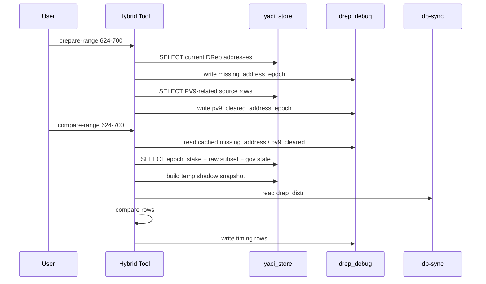

# DRep Distribution Hybrid Batch Compare

## Mục tiêu

Tài liệu này mô tả:

1. Vì sao tool hybrid batch compare vẫn bám đúng nghiệp vụ của `DRepDistService`.
2. Thiết kế kỹ thuật của tool mới.
3. Cách sử dụng để compare nhiều epoch Conway mà không ảnh hưởng đến sync hay dữ liệu nguồn của `yaci-store`.

Tool được implement tại:

- `e2e-tests/tools/drep_dist_batch_compare.py`
- `bin/drep-dist-batch-compare.sh`

## Bài toán

Trước đây, để debug mismatch của `drep_dist`, quy trình thường là:

1. Chạy SQL thủ công để tạo các bảng kiểu `drep_dist1`, `ss1_*`.
2. Chạy comparator sửa tay để đọc từ các bảng đó.
3. Chỉ kiểm tra được từng epoch một.

Cách làm này có 3 nhược điểm chính:

- chậm
- thao tác thủ công nhiều
- dễ ảnh hưởng namespace debug nếu phải tạo nhiều bảng vật lý

Mục tiêu của tool mới là:

- compare được nhiều epoch
- không ghi vào `drep_dist` chính thức
- không sửa bất kỳ dữ liệu nguồn nào trong `yaci_store`
- nhanh hơn đáng kể so với full recompute per epoch

## Cam kết an toàn

Tool được thiết kế theo nguyên tắc read-only đối với dữ liệu nguồn:

- Trên schema `yaci_store`, tool chỉ `SELECT`.
- Tool không `INSERT`, `UPDATE`, `DELETE`, `TRUNCATE`, `ALTER`, `DROP`, `CREATE INDEX` vào các bảng nguồn.
- Mọi object phục vụ tăng tốc chỉ nằm trong:
  - schema `drep_debug`
  - `TEMP TABLE` của session PostgreSQL

Điều này có nghĩa là:

- không ảnh hưởng `drep_dist`
- không ảnh hưởng quá trình sync của `yaci-store`
- có thể xóa schema `drep_debug` mà không làm thay đổi dữ liệu nghiệp vụ

## Nguồn nghiệp vụ gốc

Tool hybrid không tự định nghĩa lại nghiệp vụ. Nó lấy nghiệp vụ từ 2 nguồn đã có trong code:

1. `aggregates/governance-aggr/.../DRepDistService.java`
2. `aggregates/adapot/.../StakeSnapshotService.java`

`DRepDistService` là nguồn nghiệp vụ gốc cho snapshot `drep_dist`.

Các phần quan trọng:

- Xác định `epoch = currentEpoch - 1`
- Xác định bootstrap/PV9/PV10 boundary
- Lấy current DRep delegation
- Xác định DRep status hợp lệ
- Tính governance deposit adjustment
- Áp dụng PV9 cleared addresses
- Aggregate thành `drep_dist`

`StakeSnapshotService` là nguồn nghiệp vụ gốc của `epoch_stake`.

Điểm quan trọng nhất của thiết kế hybrid là:

- `epoch_stake[epoch]` đã materialize sẵn phần lớn công thức stake-base mà `DRepDistService` cũng dùng lại
- vì vậy ta có thể tái sử dụng `epoch_stake` làm base, thay vì scan lại toàn bộ `stake_address_balance`, `reward`, `instant_reward`, `reward_rest`, `withdrawal` cho mọi address của từng epoch

## Công thức nghiệp vụ gốc

### 1. Công thức base của `epoch_stake`

Trong `StakeSnapshotService`, amount của `epoch_stake[epoch]` là:

```text
stake_address_balance
+ pool reward (member, leader) với spendable_epoch <= epoch + 1
+ refund reward với spendable_epoch <= epoch
+ instant reward với spendable_epoch <= epoch + 1
+ reward_rest với spendable_epoch <= epoch
```

Nói ngắn gọn:

```text
epoch_stake_base(epoch)
= balance(epoch)
+ member_leader_reward(<= epoch + 1)
+ refund(<= epoch)
+ instant_reward(<= epoch + 1)
+ reward_rest(<= epoch)
```

### 2. Công thức base của `DRepDistService`

Trong `DRepDistService.takeStakeSnapshot(currentEpoch)`, với `epoch = currentEpoch - 1`, amount của mỗi address trước khi group theo DRep là:

```text
stake_address_balance
+ pool reward (member, leader) với spendable_epoch <= currentEpoch
+ refund reward với spendable_epoch <= currentEpoch
+ instant reward với spendable_epoch <= currentEpoch
+ reward_rest với spendable_epoch <= currentEpoch
+ active proposal deposit
- scheduled-to-drop proposal deposit
```

Nói ngắn gọn:

```text
drep_base(currentEpoch)
= balance(epoch)
+ member_leader_reward(<= currentEpoch)
+ refund(<= currentEpoch)
+ instant_reward(<= currentEpoch)
+ reward_rest(<= currentEpoch)
+ gov_active_deposit(currentEpoch)
- gov_drop_deposit(currentEpoch)
```

## Ý tưởng hybrid có hợp lý về nghiệp vụ không?

Có, vì đây là một phép tách bài toán theo address, không phải heuristic.

### Quan sát quan trọng

Với `currentEpoch = E` và `epoch = E - 1`:

- `epoch_stake[epoch]` đã chứa:
  - `balance(epoch)`
  - `member_leader_reward(<= E)`
  - `instant_reward(<= E)`
- nhưng **chưa chứa đủ**:
  - `refund(<= E)` nếu refund mới trở nên spendable đúng ở `E`
  - `reward_rest(<= E)` nếu `reward_rest` mới trở nên spendable đúng ở `E`

Lý do:

- `StakeSnapshotService` dùng:
  - `refund <= epoch`
  - `reward_rest <= epoch`
- trong khi `DRepDistService` dùng:
  - `refund <= currentEpoch`
  - `reward_rest <= currentEpoch`

Vì `currentEpoch = epoch + 1`, chênh lệch đúng bằng phần delta ở `spendable_epoch = currentEpoch`.

### Phép biến đổi chính

Do đó, với các address đã có row trong `epoch_stake[epoch]`, ta có:

```text
drep_financial_base(E)
= epoch_stake[E - 1]
+ refund_delta(spendable_epoch = E)
+ reward_rest_delta(spendable_epoch = E)
```

Đây là lý do tool hybrid cộng thêm:

- `ss_epoch_stake_delta_pool_refund_rewards`
- `ss_epoch_stake_delta_reward_rest`

### Vì sao không cần delta cho member/leader reward và instant reward?

Vì hai phần này đã align sẵn:

- `StakeSnapshotService` dùng `spendable_epoch <= epoch + 1`
- `DRepDistService` dùng `spendable_epoch <= currentEpoch`
- mà `currentEpoch = epoch + 1`

Nên:

- member/leader reward: đã khớp
- instant reward: đã khớp

### Address partition: không bỏ sót address

Hybrid flow chia address thành 2 tập:

1. `base_from_epoch_stake`
2. `missing_base_from_raw`

Trong đó:

```text
current_drep_address
= addresses có current DRep delegation tới epoch E - 1
```

Tool tạo:

```text
missing_address
= current_drep_address
 - addresses xuất hiện trong epoch_stake[E - 1]
```

Sau đó:

- nếu address có trong `epoch_stake[E - 1]`: dùng hybrid base
- nếu address không có trong `epoch_stake[E - 1]`: fallback sang raw-table formula giống `DRepDistService`

Do đó:

```text
all_effective_addresses
= base_from_epoch_stake
 UNION ALL
  missing_base_from_raw
```

Nếu partition này đúng, tool không mất address nào.

### Vì sao fallback raw giữ được tính đúng đắn?

Với `missing_base_from_raw`, tool không xấp xỉ.

Nó vẫn tính lại theo raw tables:

- `stake_address_balance`
- `reward`
- `reward_rest`
- `instant_reward`
- `withdrawal`

nhưng chỉ cho tập `missing_address`, thay vì cho toàn bộ address set.

Nói cách khác:

- đúng logic cũ
- chỉ đổi phạm vi scan

### Governance logic có bị thay đổi không?

Không.

Tool vẫn áp dụng nguyên vẹn:

- `ss_gov_active_proposal_deposits`
- `ss_gov_scheduled_to_drop_proposal_deposits`

Sau khi reconstruct financial base, tool mới cộng/trừ governance adjustment, đúng thứ tự logic của `DRepDistService`.

### DRep validity / bootstrap / PV9 / exclusions có bị thay đổi không?

Không.

Hybrid flow vẫn giữ nguyên:

- bootstrap/PV9/PV10 boundary
- current DRep delegation logic
- `ss_drep_status`
- `valid delegation condition`
- hardcoded delegation exclusions
- `ss_pv9_cleared_addresses`
- virtual DRep handling cho `ABSTAIN` và `NO_CONFIDENCE`

Tức là phần được tối ưu chỉ là **financial base reconstruction**, không phải business filters của DRep.

## Kết luận nghiệp vụ

Hybrid flow là hợp lý về mặt nghiệp vụ vì:

1. Nó giữ nguyên toàn bộ DRep-specific business rules từ `DRepDistService`.
2. Nó dùng `epoch_stake` như một materialized sub-result đã có sẵn từ `StakeSnapshotService`.
3. Nó bù lại đúng các delta mà `epoch_stake` chưa chứa.
4. Với address không dùng được `epoch_stake`, nó quay về raw logic giống bản gốc.

Vì vậy, đây là một **phép decomposition để tăng tốc**, không phải một phép xấp xỉ.

## Kiến trúc tổng thể

```mermaid
flowchart TD
    A[compare-range E] --> B[resolve epoch context]
    B --> C[prepare-range cache]
    C --> C1[missing_address_epoch in drep_debug]
    C --> C2[pv9_cleared_address_epoch in drep_debug]
    B --> D[current DRep addresses]
    D --> E{address exists in epoch_stake[E-1]?}
    E -->|yes| F[base_from_epoch_stake + delta refund + delta reward_rest]
    E -->|no| G[recompute base from raw tables for missing subset]
    F --> H[apply gov adjustments]
    G --> H
    H --> I[apply DRep validity filters]
    I --> J[apply PV9 cleared + hardcoded exclusions]
    J --> K[aggregate by DRep]
    K --> L[compare with cardano-db-sync]
    L --> M[write reports + timings]
```

## Pha prepare và compare



## Thiết kế chi tiết

### 1. `prepare-range`

`prepare-range` làm 2 việc:

- tạo schema debug nếu chưa có
- build cache theo epoch

Các bảng debug chính:

- `drep_debug.cache_state`
- `drep_debug.missing_address_epoch`
- `drep_debug.pv9_cleared_address_epoch`
- `drep_debug.run_timing`

`prepare-range` không cần `db-sync`.

### 2. `compare-range`

`compare-range` dùng cache đã có và chạy shadow compare theo từng epoch.

Các bước chính:

1. resolve bootstrap context
2. dựng `ss_current_drep_address`
3. đọc `missing_address_epoch`
4. đọc `pv9_cleared_address_epoch`
5. dựng `base_from_epoch_stake`
6. dựng `missing_base_from_raw`
7. apply governance adjustments
8. apply DRep validity filters
9. aggregate vào `tmp_drep_dist`
10. compare với `db-sync`

### 3. Shadow `drep_dist` được lưu ở đâu?

Sau khi `compare-range` chạy xong, kết quả shadow không chỉ nằm trong report JSON.

Tool hiện lưu persistent vào:

- `drep_debug.shadow_drep_dist`

Schema của bảng này:

- `snapshot_epoch`
- `drep_hash`
- `drep_type`
- `drep_id`
- `amount`
- `run_id`
- `created_at`

Điểm quan trọng:

- đây là bảng debug riêng
- không phải `yaci_store.drep_dist`
- có thể query tay lại bất cứ lúc nào

Ví dụ:

```sql
SELECT drep_hash, drep_type, drep_id, amount
FROM drep_debug.shadow_drep_dist
WHERE snapshot_epoch = 624
ORDER BY drep_type, drep_id, drep_hash;
```

### 4. Nếu chạy lại cùng epoch thì có bị chồng dữ liệu không?

Không.

Khi `compare-range` tính lại `snapshot_epoch = E`, tool sẽ:

1. `DELETE FROM drep_debug.shadow_drep_dist WHERE snapshot_epoch = E`
2. `INSERT` lại toàn bộ shadow rows mới của epoch đó

Nghĩa là:

- dữ liệu debug cho epoch đó luôn là bản mới nhất
- không bị duplicate
- vẫn không đụng tới bảng chính thức `drep_dist`

### 5. Timing

Tool track thời gian từng query lớn bằng marker:

```text
STEP_TIMING|<step_name>|<duration_ms>
```

và lưu thêm vào:

- `drep_debug.run_timing`

Nhờ đó có thể xác định chính xác step chậm nhất của từng epoch.

## Các invariant cần đúng

Để hybrid flow được xem là tương đương nghiệp vụ, cần giữ các invariant sau:

### Invariant 1

```text
current_drep_address
= base_from_epoch_stake.address
 UNION
  missing_base_from_raw.address
```

Không được bỏ sót address.

### Invariant 2

Với address thuộc `base_from_epoch_stake`:

```text
hybrid_base
= epoch_stake[E - 1]
+ refund_delta(E)
+ reward_rest_delta(E)
```

phải bằng financial base mà `DRepDistService` sẽ dùng cho chính address đó.

### Invariant 3

Với address thuộc `missing_base_from_raw`:

- tool phải dùng đúng raw logic của `DRepDistService`
- không được dùng xấp xỉ

### Invariant 4

Các business filters sau phải giữ nguyên:

- `valid delegation condition`
- hardcoded exclusions
- PV9 cleared addresses
- stake deregistration filter
- governance deposit adjustment

## Hướng dẫn sử dụng

### 1. Chuẩn bị biến môi trường

```bash
export STORE_HOST=10.4.10.112
export STORE_PORT=5432
export STORE_DB=yaci_store
export STORE_USER=yaci
export STORE_PASSWORD=dbpass
export STORE_SCHEMA=yaci_store

export DBSYNC_HOST=10.4.10.135
export DBSYNC_PORT=5678
export DBSYNC_DB=cexplorer
export DBSYNC_USER=dbsync
export DBSYNC_PASSWORD=dbsync
export DBSYNC_SCHEMA=public
```

### 2. Build cache trước

```bash
yaci-store/bin/drep-dist-batch-compare.sh prepare-range \
  --epochs 624-700 \
  --workers 1
```

### 3. Chạy compare

```bash
yaci-store/bin/drep-dist-batch-compare.sh compare-range \
  --epochs 624-700 \
  --workers 1
```

### 4. Chạy một epoch để benchmark

```bash
yaci-store/bin/drep-dist-batch-compare.sh compare-range \
  --epochs 624 \
  --workers 1 \
  --report-dir /tmp/drep-compare-624
```

### 5. Một số option quan trọng

- `--debug-schema drep_debug`
- `--work-mem 1GB`
- `--maintenance-work-mem 2GB`
- `--temp-buffers 512MB`
- `--parallel-workers-per-gather 4`
- `--effective-cache-size 48GB`
- `--random-page-cost 1.1`
- `--effective-io-concurrency 64`
- `--keep-jit` nếu muốn giữ JIT

## Output

Mỗi run sinh ra:

- `run_config.json`
- `summary.csv`
- `summary.json`
- `epochs/epoch_<N>.json`

Trong `epoch_<N>.json` có:

- `status`
- `mismatch_count`
- `cache_hits`
- `cache_counts`
- `base_source_counts`
- `shadow_storage`
- `timings`
- `mismatches`

## Cách đọc kết quả

Ví dụ ở epoch `624`, report có thể cho thấy:

- `from_epoch_stake = 261709`
- `from_missing_raw = 57444`
- `missing_address_count = 57444`

Ý nghĩa:

- phần lớn address đã được cover bởi `epoch_stake`
- chỉ khoảng 18% address phải fallback raw

Nếu timing cho thấy:

- `ss_missing_pool_rewards_create` là step lớn nhất

thì bottleneck hiện tại nằm ở raw fallback của `reward`, không còn ở full recompute toàn bộ chain như trước.

## Kết quả benchmark hiện tại

Smoke run thực tế trên epoch `624`:

- `prepare-range --epochs 624`: khoảng `3 giây`
- `compare-range --epochs 624`: khoảng `121 giây`

Quan sát:

- nhanh hơn rõ rệt so với full-scan cũ khoảng `14 phút`
- mismatch còn lại vẫn là mismatch nghiệp vụ đã biết:
  - `abstain_mismatch`

Điều này cho thấy:

- logic compare end-to-end vẫn hoạt động
- tăng tốc đạt được mà không đổi bản chất mismatch đang điều tra

## Giới hạn hiện tại

Tài liệu này không khẳng định chỉ từ benchmark một epoch là đã chứng minh xong toàn bộ Conway era.

Để chốt hoàn toàn tính tương đương nghiệp vụ, nên chạy thêm:

1. một dải epoch Conway
2. đối chiếu với baseline full SQL/manual cũ
3. sample một số address thuộc cả hai nhóm:
   - `base_from_epoch_stake`
   - `missing_base_from_raw`

Nếu tất cả invariant phía trên đều giữ, hybrid flow có thể xem là đủ tin cậy để thay thế workflow thủ công trước đây.

## Checklist validate trước khi dùng rộng

- `prepare-range` chạy thành công cho range cần so sánh
- `compare-range` không ghi vào `drep_dist`
- `base_from_epoch_stake + missing_base_from_raw` cover đủ current addresses
- mismatch mới không tăng đột biến so với baseline cũ
- top timing không còn nằm ở full-scan toàn bộ history

## Tóm tắt

Hybrid batch compare là một thiết kế:

- an toàn với dữ liệu nguồn
- nhanh hơn đáng kể
- vẫn bám nghiệp vụ gốc của `DRepDistService`

Điểm cốt lõi là:

- dùng `epoch_stake` như một materialized base đã đúng nghiệp vụ cho phần lớn address
- cộng lại đúng delta còn thiếu
- fallback raw cho phần address chưa thể dùng `epoch_stake`
- giữ nguyên toàn bộ DRep business filters ở tầng trên
