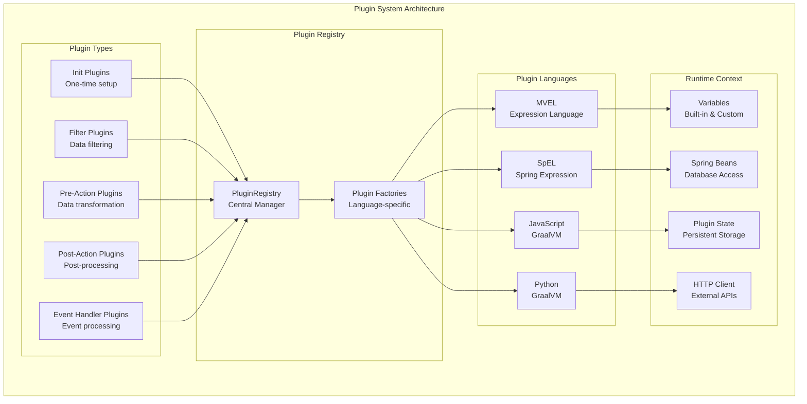
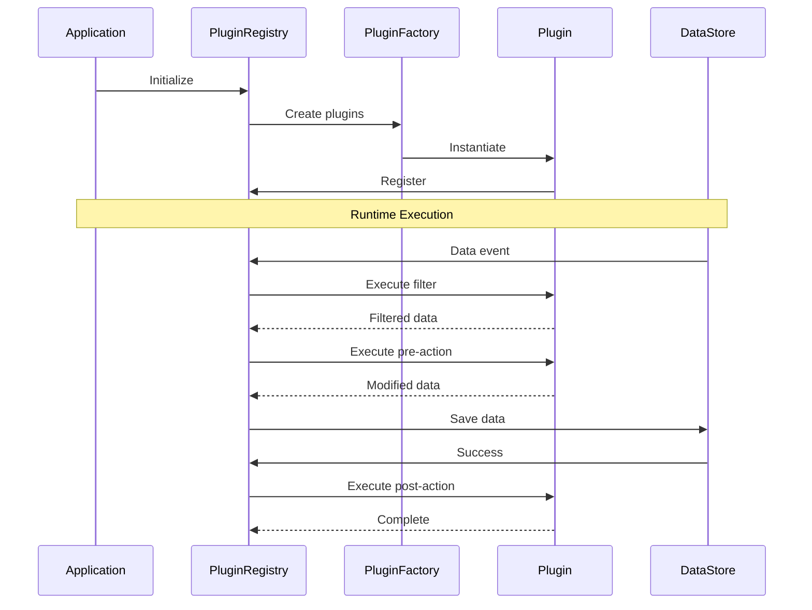

# Yaci-Store Plugin Framework Overview

**A Comprehensive Guide to the Plugin Architecture**

## Introduction

The Yaci-Store Plugin Framework provides a powerful and flexible way to extend the functionality of yaci-store without modifying its core code. This document provides a deep dive into the plugin architecture, its design principles, and how it integrates with the yaci-store ecosystem.

## Architecture Overview



## Core Concepts

### 1. Plugin Types

The framework supports five distinct plugin types, each serving a specific purpose in the data processing pipeline:

#### **Init Plugins**
- **Purpose**: One-time initialization tasks
- **When executed**: During application startup
- **Use cases**: 
  - Setting up external connections
  - Initializing shared resources
  - Configuring global variables
  - Database schema setup

#### **Filter Plugins**
- **Purpose**: Filter data before storage
- **When executed**: Before data persistence
- **Use cases**:
  - Filtering UTXOs by policy ID
  - Selecting specific metadata labels
  - High-value transaction filtering
  - Address-based filtering

#### **Pre-Action Plugins**
- **Purpose**: Transform data before storage
- **When executed**: After filtering, before persistence
- **Use cases**:
  - Data enrichment
  - Field modification
  - Format conversion
  - Custom calculations

#### **Post-Action Plugins**
- **Purpose**: Execute actions after data storage
- **When executed**: After successful persistence
- **Use cases**:
  - Webhook notifications
  - External system updates
  - Analytics and reporting
  - Cache updates

#### **Event Handler Plugins**
- **Purpose**: React to blockchain events
- **When executed**: When specific events are published
- **Use cases**:
  - Custom indexing
  - Real-time notifications
  - Event aggregation
  - Cross-store operations

### 2. Plugin Languages

The framework supports multiple scripting languages through different execution engines:

#### **MVEL (MVFLEX Expression Language)**
- **Best for**: Complex logic, all plugin types
- **Features**:
  - Java-like syntax
  - Direct Java object access
  - High performance
  - Rich standard library

#### **SpEL (Spring Expression Language)**
- **Best for**: Simple expressions, filters
- **Features**:
  - Spring ecosystem integration
  - Property access syntax
  - Bean references
  - Limited to expressions

#### **JavaScript**
- **Best for**: Complex logic, familiar syntax
- **Features**:
  - ES6+ support via GraalVM
  - Async operations
  - JSON manipulation
  - NPM modules (limited)

#### **Python**
- **Best for**: Data processing, external integrations
- **Features**:
  - Python 3.x syntax via GraalVM
  - Database access
  - HTTP client
  - Rich data structures

### 3. Plugin Lifecycle



## Plugin Execution Flow

### Storage Plugin Flow

Storage plugins (filter, pre-action, post-action) are attached to specific extension points:

```
Extension Point Format: {store}.{target}.{action}
Examples:
- utxo.unspent.save
- metadata.save
- transaction.save
```

**Execution Order:**
1. **Filters** - Multiple filters are AND'ed together
2. **Pre-Actions** - Execute in definition order
3. **Data Storage** - Actual persistence
4. **Post-Actions** - Execute in definition order

### Event Handler Flow

Event handlers listen to specific blockchain events:

```
Event Types:
- BlockEvent
- TransactionEvent
- MintBurnEvent
- GovernanceEvent
- AddressUtxoEvent
- RollbackEvent
```

**Execution:**
- Asynchronous by default
- Can be synchronous if needed
- Multiple handlers per event type
- Independent execution

## Plugin Context and Variables

### Built-in Variables

Every plugin has access to a rich context:

#### **For Storage Plugins**
- `items` - List of data items being processed
- `metadata` - Event metadata (epoch, slot, block info)
- `beans` - Spring beans for database access
- `httpClient` - HTTP client for external APIs
- `state` - Persistent state storage
- `logger` - Logging facility

#### **For Event Handlers**
- `event` - The complete event object
- All variables from storage plugins
- Event-specific data structures

### Variable Providers

Custom variable providers can inject additional functionality:

```java
public interface VariableProvider {
    String getName();
    Object getValue();
}
```

Common use cases:
- Database connections
- External service clients
- Configuration values
- Utility functions

## Plugin Configuration

### Configuration Structure

```yaml
store:
  plugins:
    enabled: true
    
    # Global scripts (loaded once)
    global-scripts:
      - lang: python
        file: /app/plugins/scripts/utils.py
    
    # Init plugins
    initializers:
      python:
        name: "Database Setup"
        script:
          file: /app/plugins/scripts/init.py
          function: initialize
    
    # Filter plugins
    filters:
      utxo.unspent.save:
        - name: "High Value Filter"
          lang: mvel
          expression: "lovelaceAmount > 1000000000"
    
    # Pre-action plugins
    pre-actions:
      metadata.save:
        - name: "Enrich Metadata"
          lang: python
          script:
            file: /app/plugins/scripts/enrich.py
            function: enrich_metadata
    
    # Post-action plugins
    post-actions:
      transaction.save:
        - name: "Webhook Notification"
          lang: js
          inline-script: |
            if (items.length > 0) {
              httpClient.post(webhookUrl, { transactions: items });
            }
    
    # Event handlers
    event-handlers:
      BlockEvent:
        - name: "Block Monitor"
          lang: mvel
          script:
            file: /app/plugins/scripts/block-monitor.mvel
            function: handleBlock
```

### Plugin Definition Options

Each plugin can be defined using:

1. **Expression** (filters only, MVEL/SpEL)
2. **Inline Script** 
3. **Script File with Function**

```yaml
# Expression (simple boolean)
expression: "amount > 1000000"

# Inline script
inline-script: |
  result = [];
  for (item : items) {
    if (item.amount > 1000000) {
      result.add(item);
    }
  }
  return result;

# External script
script:
  file: /path/to/script.py
  function: process_items
```

## Performance Considerations

### Plugin Pooling

For GraalVM-based plugins (JavaScript, Python), the framework uses context pooling:

```yaml
store:
  polyglot:
    pool-size: 10  # Number of contexts per language
```

### Best Practices for Performance

1. **Use appropriate plugin types**
   - Filters for simple boolean logic
   - Pre/post actions for complex transformations
   - Event handlers for async processing

2. **Minimize external calls**
   - Cache frequently used data
   - Batch HTTP requests
   - Use connection pooling

3. **Optimize script execution**
   - Avoid heavy computations in filters
   - Use native Java objects efficiently
   - Leverage built-in functions

4. **Memory management**
   - Clean up large objects
   - Use streaming for large datasets
   - Monitor memory usage

## Security Considerations

### Plugin Isolation

- Each plugin runs in a controlled environment
- Limited access to system resources
- No file system access by default
- Network access through provided clients

### Best Practices

1. **Input validation**
   - Validate all external inputs
   - Sanitize data before processing
   - Handle malformed data gracefully

2. **Error handling**
   - Use try-catch blocks
   - Log errors appropriately
   - Fail gracefully

3. **Resource limits**
   - Set timeouts for external calls
   - Limit memory usage
   - Monitor CPU usage

## Debugging and Monitoring

### Logging

Plugins have access to logging:

```python
# Python
logger.info("Processing {} items".format(len(items)))
logger.error("Failed to process", e)
```

```javascript
// JavaScript
console.log(`Processing ${items.length} items`);
console.error('Failed to process', error);
```

### Debugging Tips

1. **Use verbose logging during development**
2. **Test with small datasets first**
3. **Monitor plugin execution time**
4. **Check error logs for exceptions**
5. **Use inline scripts for quick testing**

### Monitoring

- Plugin execution metrics
- Success/failure rates
- Execution time histograms
- Memory usage patterns

## Advanced Features

### State Management

Plugins can maintain persistent state:

```python
# Python
def handle_event(event, context):
    state = context.state
    
    # Get or initialize counter
    counter = state.get("event_count", 0)
    counter += 1
    state.put("event_count", counter)
    
    if counter % 1000 == 0:
        logger.info(f"Processed {counter} events")
```

### HTTP Client

Built-in HTTP client for external integrations:

```javascript
// JavaScript
function notifyWebhook(items) {
    const payload = {
        timestamp: new Date().toISOString(),
        items: items.map(i => ({
            txHash: i.tx_hash,
            amount: i.amount
        }))
    };
    
    const response = httpClient.post(
        'https://api.example.com/webhook',
        payload,
        { 'Authorization': 'Bearer token123' }
    );
    
    if (response.status !== 200) {
        console.error('Webhook failed:', response.body);
    }
}
```

### Database Access

Direct database access through Spring beans:

```python
# Python
def query_historical_data(event, context):
    # Access repository beans
    blockRepo = context.beans.get("blockRepository")
    
    # Query last 10 blocks
    recent_blocks = blockRepo.findTop10ByOrderByNumberDesc()
    
    for block in recent_blocks:
        print(f"Block {block.number}: {block.hash}")
```

## Migration Guide

### From Filters to Plugins

If you're currently using simple filters, here's how to migrate:

**Before (simple filter):**
```properties
store.utxo.filter.policy-ids=abc123,def456
```

**After (plugin):**
```yaml
store:
  plugins:
    filters:
      utxo.unspent.save:
        - name: "Policy Filter"
          lang: mvel
          expression: |
            amounts.any { it.policy in ['abc123', 'def456'] }
```

### Adding Custom Logic

To add custom processing logic:

1. **Identify the extension point**
2. **Choose appropriate plugin type**
3. **Select language based on complexity**
4. **Write and test the plugin**
5. **Deploy with configuration**

## Troubleshooting

### Common Issues

#### Plugin Not Executing
- Check if plugins are enabled
- Verify extension point name
- Check plugin syntax errors
- Review logs for exceptions

#### Performance Issues
- Increase pool size for polyglot plugins
- Optimize plugin logic
- Use caching where appropriate
- Consider async processing

#### Memory Issues
- Monitor heap usage
- Clean up large objects
- Use streaming for large datasets
- Increase JVM memory if needed

## Conclusion

The Yaci-Store Plugin Framework provides a powerful and flexible way to extend blockchain indexing capabilities. By understanding the architecture, following best practices, and leveraging the rich plugin context, developers can build sophisticated data processing pipelines tailored to their specific needs.

For practical examples and implementation details, see:
- [Plugin Getting Started Guide](./plugin-getting-started.mdx)
- [Plugin API Reference](./plugin_api-guide.mdx)
- [Plugin Examples](./plugin-examples.mdx)