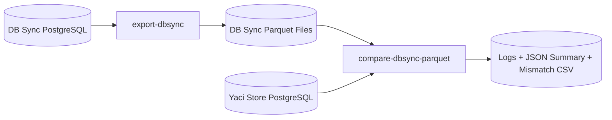
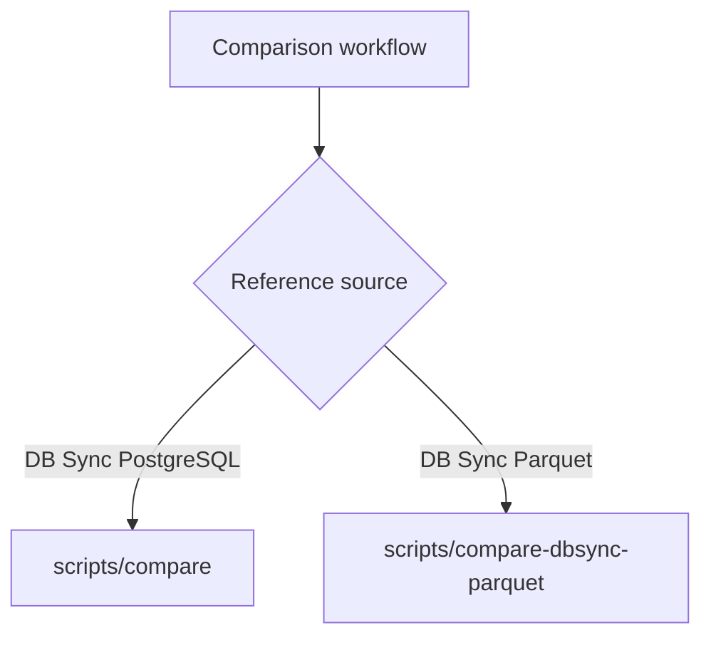
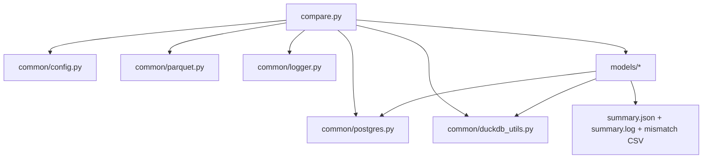
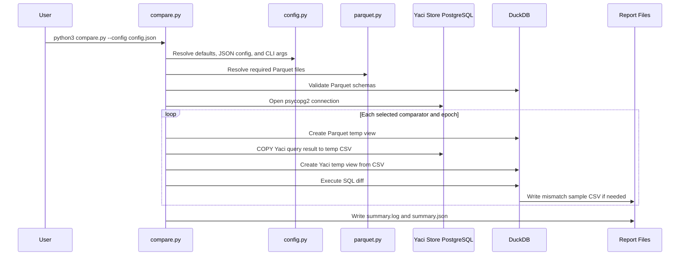
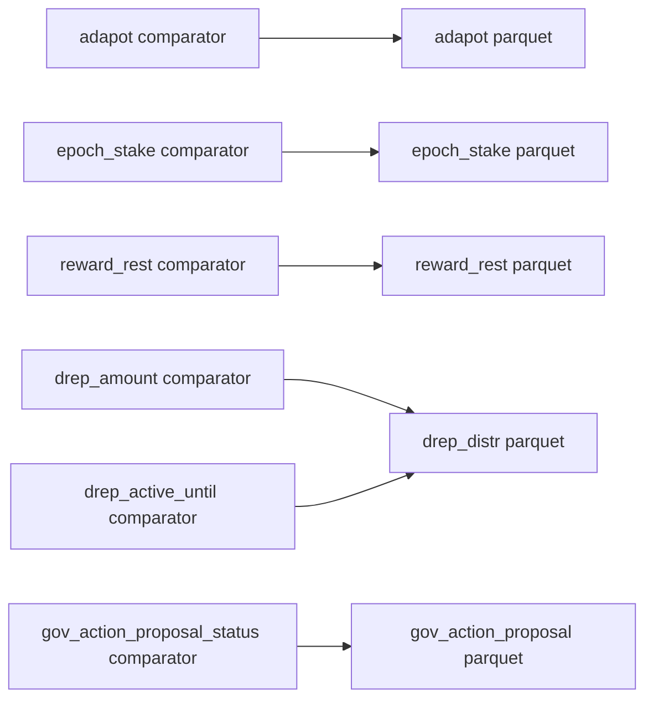
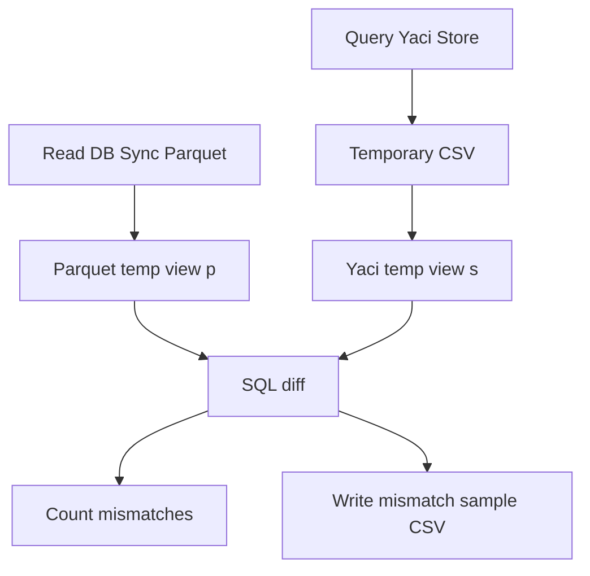
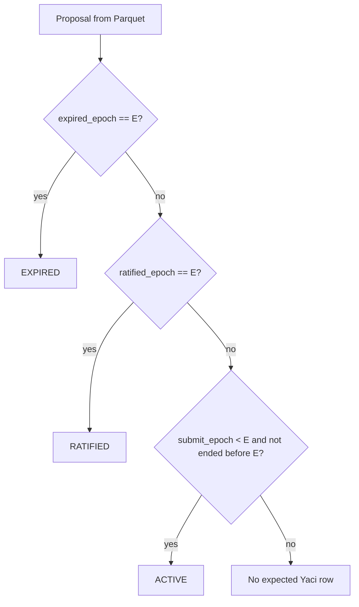
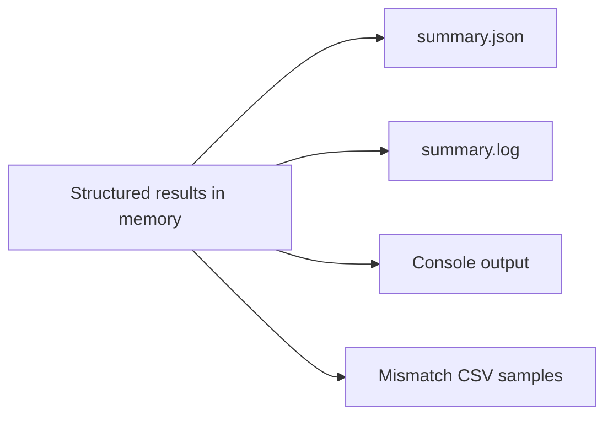

# Design: DB Sync Parquet Comparison Tool

This document describes the architecture and implementation rationale for
`scripts/compare-dbsync-parquet`. The tool compares a Yaci Store PostgreSQL
database against DB Sync reference data stored as Parquet files.

## 1. Purpose

The tool supports validation workflows where DB Sync data is available as an
offline Parquet reference, but direct access to the DB Sync PostgreSQL database
is not required at comparison time.

It compares:

- **Reference source**: DB Sync data exported to Parquet files.
- **Candidate source**: Yaci Store data read from PostgreSQL.

This is separate from `scripts/compare`, which compares DB Sync PostgreSQL
directly against Yaci Store PostgreSQL.

| Tool | Reference source | Candidate source | Typical use |
| --- | --- | --- | --- |
| `scripts/compare` | DB Sync PostgreSQL | Yaci Store PostgreSQL | Both databases are accessible |
| `scripts/compare-dbsync-parquet` | DB Sync Parquet files | Yaci Store PostgreSQL | DB Sync is unavailable at comparison time |

## 2. High-Level Architecture



The workflow is intentionally split into two stages:

1. Export selected DB Sync comparison models to Parquet.
2. Compare Yaci Store data against those Parquet files.

This makes DB Sync an offline reference dataset and removes DB Sync PostgreSQL
as a runtime dependency for the comparison tool.

## 3. Technology Choices

### Python

Python is used because the related comparison and export utilities are already
implemented as Python scripts under `scripts/`.

Benefits:

- No Java build step is required for data validation tasks.
- The command-line workflow stays consistent with nearby tools.
- JSON configuration and CLI override behavior can follow existing conventions.
- Model-specific comparison logic can be added incrementally.

Trade-offs:

- Python should not load very large comparison datasets into in-memory lists or
  dictionaries.
- Without clear module boundaries, script-based tools can accumulate duplicated
  logic.

The implementation addresses these trade-offs by keeping Python responsible for
orchestration and delegating set-based comparison work to DuckDB.

### DuckDB

DuckDB is used as the local SQL engine for Parquet reads and diff queries.

Benefits:

- Reads Parquet files directly through `read_parquet(...)`.
- Supports SQL joins, aggregation, `FULL OUTER JOIN`, `IS DISTINCT FROM`, and
  CSV export for mismatch samples.
- Avoids loading full datasets into Python memory.
- Allows an optional memory limit through `duckdb_memory_limit`.

Trade-offs:

- Requires the Python `duckdb` package. The DuckDB CLI alone is not sufficient.
- SQL comparison logic must be reviewed carefully for each model's semantics.
- The tool does not use DuckDB's PostgreSQL extension, avoiding that additional
  runtime dependency.

### psycopg2

Yaci Store data is read with `psycopg2`, matching the existing comparison
scripts.

Benefits:

- Uses the same PostgreSQL access pattern as `scripts/compare`.
- Does not require DuckDB PostgreSQL extensions.
- Supports PostgreSQL `COPY` for efficient query result export.

Trade-offs:

- Yaci Store query results are staged through temporary CSV files before being
  read by DuckDB.
- Temporary files must be managed and cleaned up after the run.

## 4. Why This Is a Separate Tool

The existing `scripts/compare` utilities compare two live PostgreSQL databases.
This tool compares one live PostgreSQL database with offline Parquet reference
files. Those are different source contracts.



Keeping the tools separate has several advantages:

- Existing DB-vs-DB workflows remain unchanged.
- Runtime dependencies and error modes are clearer.
- The Parquet data model can be documented separately from the DB Sync schema.
- The implementation can evolve independently and be merged into shared helpers
  later if stable patterns emerge.

The main cost is some duplication of domain comparison semantics. This is kept
small by isolating common config, logging, Parquet resolution, PostgreSQL, and
DuckDB helpers under `common/`.

## 5. Module Layout

```text
scripts/compare-dbsync-parquet/
  compare.py
  config.example.json
  README.md
  DESIGN.md
  common/
    config.py
    duckdb_utils.py
    logger.py
    parquet.py
    postgres.py
  models/
    adapot.py
    epoch_stake.py
    reward_rest.py
    drep.py
    gov_action_proposal_status.py
    helpers.py
```



| Module | Responsibility |
| --- | --- |
| `compare.py` | CLI, config resolution, connection lifecycle, model orchestration, final reporting |
| `common/config.py` | Defaults, JSON config loading, CLI override handling, path resolution, URL redaction |
| `common/parquet.py` | Comparator-to-dataset mapping, Parquet file resolution, schema validation |
| `common/postgres.py` | Yaci Store connection and PostgreSQL `COPY` to temporary CSV |
| `common/duckdb_utils.py` | DuckDB context, Parquet/CSV views, diff counting, mismatch sample export |
| `models/*` | Model-specific comparison semantics |

## 6. Runtime Flow



Comparisons are executed per epoch. This keeps memory usage more predictable,
produces targeted mismatch samples, and allows focused reruns for a single
epoch or small range.

## 7. Configuration Model

Configuration is resolved in this order:

```text
defaults in common/config.py
  -> JSON config file
    -> CLI arguments
```

Path handling:

- Default paths are relative to the tool directory.
- Paths from a JSON config file are relative to that config file.
- Paths from CLI arguments are relative to the current working directory.

This allows the tool to be run either from the repository root or from
`scripts/compare-dbsync-parquet` with predictable file resolution.

## 8. Parquet File Resolution

Comparators do not always map one-to-one to Parquet datasets. For example,
`drep_distr` supports both DRep amount and DRep active-until comparisons.



`common/parquet.py` acts as a small dataset registry:

- `MODEL_DATASETS` maps each comparator to its required Parquet datasets.
- `DATASET_COLUMNS` defines the minimum required columns per dataset.
- The resolver supports exporter filename conventions:
  - `{dataset}_from{start_epoch}_to{end_epoch}.parquet`
  - `{dataset}_from{start_epoch}.parquet`

If multiple files cover the requested range, the resolver selects the narrowest
matching file. Explicit `parquet_files` entries in the config override automatic
resolution.

## 9. Comparison Strategy

Each model follows the same execution pattern:



The general steps are:

1. Create DuckDB temp view `p` from the DB Sync Parquet dataset.
2. Query Yaci Store with PostgreSQL and write the result to a temporary CSV.
3. Create DuckDB temp view `s` from the CSV.
4. Execute a model-specific SQL diff.
5. Count total mismatches.
6. Write a bounded mismatch sample CSV when mismatches exist.

Common SQL techniques:

- `FULL OUTER JOIN` detects rows missing from either side.
- `IS DISTINCT FROM` compares nullable values safely.
- Aggregation is used before diffing models that require multiset or special
  row semantics.

## 10. Model Semantics

| Comparator | Key semantics | Value semantics | Notes |
| --- | --- | --- | --- |
| `adapot` | `epoch` | `treasury`, `reserves` | One row per epoch |
| `epoch_stake` | `stake_address`, `pool_id` | Aggregated `amount` | Yaci Store uses `epoch = dbsync_epoch - 2`; zero amounts are ignored by default |
| `reward_rest` | Full row tuple | Multiset count | Compares duplicate row counts, not only row presence |
| `drep_amount` | DRep hash or special key | Aggregated `amount` | `ABSTAIN` and `NO_CONFIDENCE` are compared as aggregate special rows |
| `drep_active_until` | Normal DRep hash | `active_until` | Excludes special DRep rows |
| `gov_action_proposal_status` | `tx_hash`, `index` | Derived `status` | Derives expected Yaci status from DB Sync proposal lifecycle columns |

### Governance Proposal Status

DB Sync Parquet contains proposal lifecycle columns. Yaci Store stores proposal
status snapshots. The comparator derives the expected Yaci status from the DB
Sync lifecycle fields.



## 11. Reporting

The text output follows the summary style used by the existing comparison
scripts, while structured JSON is the authoritative report for automation.

```text
reports/compare_dbsync_parquet_<timestamp>/
  summary.json
  summary.log
  mismatches/
    adapot_epoch_624.csv
    drep_amount_epoch_624.csv
```



Exit codes:

| Code | Meaning |
| --- | --- |
| `0` | All selected comparisons matched |
| `1` | At least one mismatch was found |
| `2` | Configuration, dependency, schema, connection, or runtime error |

## 12. Error Handling

The tool fails early for:

- Invalid configuration.
- Invalid epoch range.
- Missing Python dependency.
- Missing Parquet file.
- Parquet schema missing required columns.

Per-comparator runtime errors are captured as `ERROR` results and included in
the final summary. Temporary files and DuckDB/PostgreSQL connections are cleaned
up in `finally` blocks.

The tool currently does not implement retry or resume behavior. For large
ranges, rerun the relevant model or epoch range after correcting the underlying
issue.

## 13. Maintainability Guidelines

To add a new comparator:

1. Add or verify the required DB Sync export dataset in `scripts/export-dbsync`.
2. Update `DATASET_COLUMNS` and `MODEL_DATASETS` in `common/parquet.py`.
3. Add a model module under `models/`.
4. Register the model in `VALID_MODELS` and `run_selected_models()` in
   `compare.py`.
5. Document the model in `README.md` and this design file.
6. Run syntax checks and a small-range smoke test.

Avoid:

- Loading full comparison datasets into Python lists or dictionaries.
- Hardcoding Parquet paths inside model modules.
- Parsing config inside model modules.
- Comparing numeric amounts as strings.

## 14. Current Limitations

- Requires the Python `duckdb` package.
- Requires a finite `start_epoch` and `end_epoch` for Yaci Store queries.
- Does not yet consume a manifest from the exporter; file resolution is based on
  filename conventions.
- Does not include automated unit tests for every SQL diff.
- Uses temporary CSV files between PostgreSQL and DuckDB instead of direct
  PostgreSQL reads through DuckDB extensions.

## 15. Future Improvements

Potential improvements:

1. Have the exporter write a `manifest.json` with range, schema, row count, file
   size, and checksums.
2. Resolve Parquet files through the manifest instead of filename conventions.
3. Add synthetic test fixtures for each comparator.
4. Add optional model-specific optimizations for very large ranges.
5. Extract shared report/config utilities if multiple script families adopt
   structured JSON summaries.
